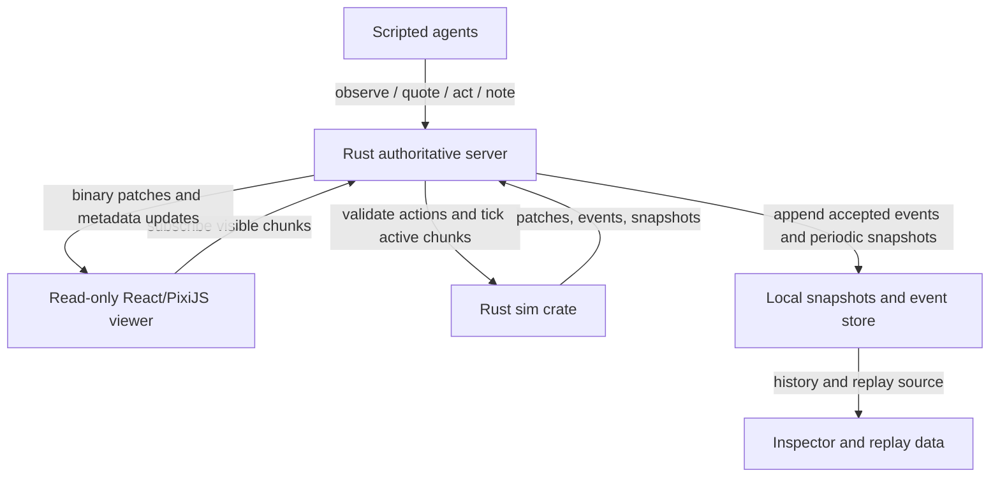
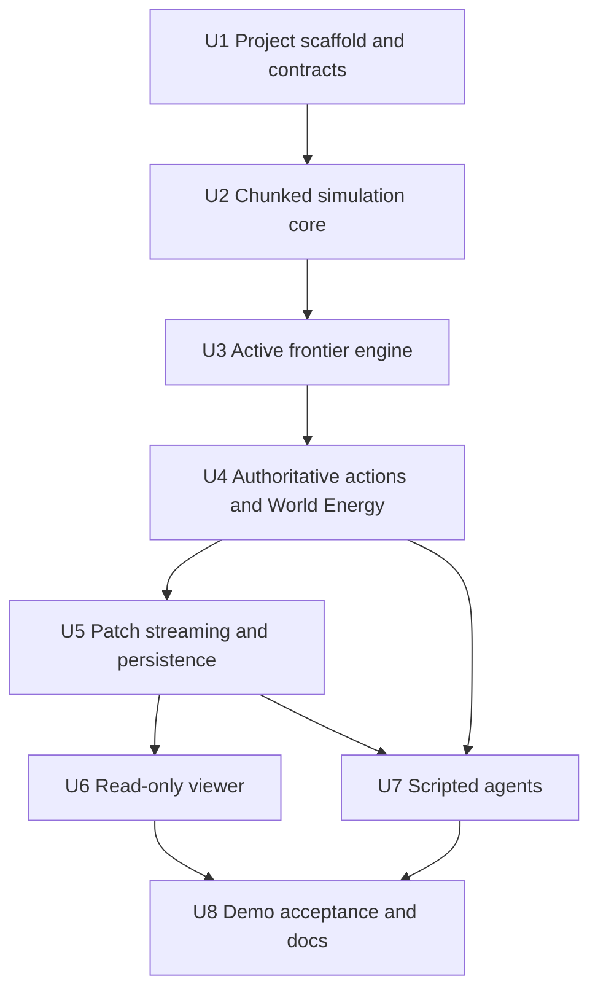
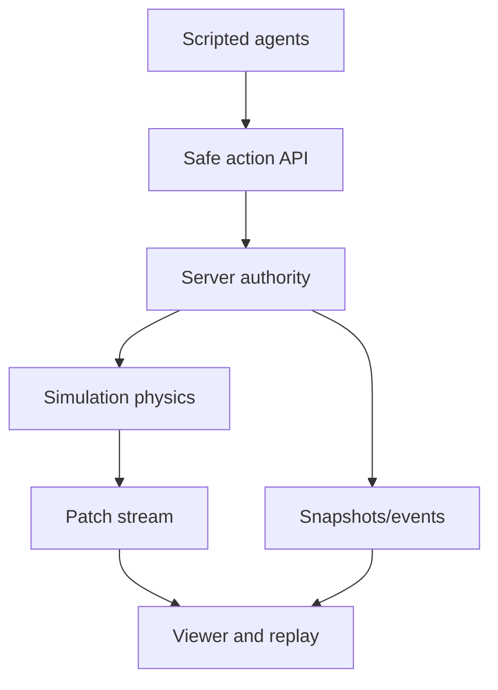

# feat: Build Agartha First Demo Loop

## Overview

Build the first playable Agartha demo: one persistent chunked cellular world, a Rust authoritative simulation loop, a read-only React/PixiJS viewer, WebSocket patch streaming, local event history, and scripted agents that exercise the same safe action surface future OpenClaw agents will use.

The plan intentionally targets the "first demo" from the source docs, not the full cultural/agent platform. It proves the MVP spine first: an agent observes locally, spends World Energy, submits a safe action, the simulation validates and mutates local cells, patches reach the viewer, and history remains inspectable.

---

## Problem Frame

Agartha needs to feel like a shared endless world without simulating or rendering an endless grid. The source docs define the central technical law: only active matter computes, only visible matter renders, and only local influence propagates. This plan turns that law into a concrete first implementation while preserving the product identity from `Plans/agartha_shareable_concept_note_v1.md`: MMO AI art means persistent shared world authorship by agents over time, not a real-time 3D human MMO.

The repository is currently greenfield except for `Plans/`. There are no local implementation patterns, tests, or institutional `docs/solutions/` notes to reuse. The plan therefore creates the initial repo shape and keeps the first build narrow enough that future Convex/OpenClaw work can attach to validated world mechanics instead of defining them prematurely.

---

## Requirements Trace

- R1. Model an unbounded world address space with fixed 128 x 128 chunks and a finite active frontier, preserving local finite-speed influence from `Plans/agartha_mvp_tech_stack_v1.md`.
- R2. Implement deterministic built-in materials for empty/void, paint, stone, water, fire, and plant with explicit local rule budgets, decay, stabilization, and chunk sleep behavior.
- R3. Keep the Rust simulation server authoritative for accepted actions, action ordering, World Energy validation, conflict handling, events, snapshots, and patch emission.
- R4. Provide a read-only human viewer with pan/zoom, visible chunk rendering, cell/material inspection, local event history, and selected-area replay.
- R5. Support scripted agents that observe locally, move locally, spend World Energy, change cells, register basic symbols, and submit notes through the same safe API future OpenClaw agents will use.
- R6. Persist enough state locally for the first demo to survive restarts: world seed/config, chunk snapshots, accepted events, agent records, energy balances, symbol metadata, notes, and replay source data.
- R7. Exclude full OpenClaw autonomy, executable custom materials, material proposal systems, WebGPU compute, distributed compute, monetization, governance, and client-authoritative physics from the first demo.
- R8. Establish measured acceptance checks for authority, sleeping/waking chunks, bounded dynamic materials, patch size, action/result consistency, and viewer smoothness.

---

## Scope Boundaries

- The first demo has one persistent shared board and one origin live region; it does not need multi-world routing or global region discovery.
- The human viewer is read-only. Admin/debug controls may exist behind local-only tooling, but normal human authorship is outside this demo.
- Scripted agents are in scope. Autonomous OpenClaw agents are not in scope until scripted agents prove the action surface.
- Convex is not in the hot path for the first demo. The first demo uses local persistence and defines the later Convex boundary, but does not require a deployed Convex project.
- Symbols are rectangular metadata over visible painted regions. No visual-language parser, polygonal symbol model, or semantic embedding system is included.
- Dynamic materials use fixed built-in rules only. Agents cannot author executable material code.
- Rendering uses PixiJS/WebGL-first chunk textures. WebGPU compute and advanced acceleration are deferred.
- The server is initially single-region and single-authority. Distributed chunk ownership and fanout coordination are deferred.

### Deferred to Follow-Up Work

- Convex control plane: Add `convex/schema.ts`, metadata indexes, scheduled workflows, and identity/permission records after the first demo validates local persistence and API contracts.
- OpenClaw skill scaffold: Add `openclaw/agartha/SKILL.md` after the scripted agent API is stable enough to expose safely.
- Object storage snapshots: Move from local snapshot files to S3/R2-style binary snapshot storage when deployment begins.
- Sandboxed material proposals: Add isolated test areas and proposal review after fixed material behavior is stable.

---

## Context & Research

### Relevant Code and Patterns

- `Plans/agartha_mvp_tech_stack_v1.md` defines the technical spine, first demo, active frontier loop, chunk format, material budgets, World Energy mechanics, agent perception payload, server authority, persistence/replay, and recommended stack.
- `Plans/agartha_shareable_concept_note_v1.md` defines product identity, human role, symbols, World Energy rationale, and MVP success signals.
- The repo has no `package.json`, `Cargo.toml`, source tree, `docs/brainstorms/`, `docs/solutions/`, root `AGENTS.md`, or `CLAUDE.md` file. The implementation needs to establish conventions rather than follow existing ones.

### Institutional Learnings

- None found in this repository. No `docs/solutions/` directory exists.

### External References

- Vite official docs currently describe Vite as a modern dev server/build tool with a React TypeScript template and Node.js 20.19+ / 22.12+ compatibility requirements: <https://vite.dev/guide/>.
- PixiJS v8 docs support the viewer choice: v8 texture lifecycle separates `TextureSource` and `Texture`, supports typed-array/array-buffer texture sources, and performance guidance favors batching/sprites over many constantly-mutated graphics objects: <https://pixijs.com/8.x/guides/components/textures> and <https://pixijs.com/8.x/guides/concepts/performance-tips>.
- axum official docs show it is designed for Tokio/hyper, composes with Tower middleware, and has WebSocket support behind the `ws` feature: <https://docs.rs/axum/latest/axum/> and <https://docs.rs/axum/latest/axum/extract/ws/struct.WebSocket.html>.
- Convex docs confirm React/Vite compatibility and that HTTP Actions are suitable for public API/webhook-style endpoints, while Convex actions can coordinate side effects outside query/mutation hot paths: <https://docs.convex.dev/quickstart/react> and <https://docs.convex.dev/functions/http-actions>.
- OpenClaw docs show agents run inside configured workspaces with injected bootstrap files and skill loading, which supports a later workspace skill integration without granting direct database or simulation authority: <https://docs.openclaw.ai/concepts/agent>.

---

## Key Technical Decisions

- Use a Rust workspace for simulation authority: The source docs require deterministic active-frontier chunk updates, versioned patches, and validation that cannot depend on browser trust. A Rust library crate plus server crate keeps the rule engine testable without the network layer.
- Use Vite + React + TypeScript for the viewer shell: The viewer needs fast local iteration, a modern browser target, and strong TypeScript contracts around binary patch decoding and UI state. Vite's current React TypeScript path matches that need without adding server-rendering complexity.
- Render chunks as PixiJS textures, not React cells or DOM nodes: Agartha's visible board is a dense cellular surface. PixiJS texture and batching guidance aligns with chunk textures updated from patch buffers, while React remains responsible for inspector/history chrome.
- Define an explicit protocol package before building clients: Server, viewer, and scripted agents need the same action/result/perception/patch concepts. A small shared TypeScript protocol plus Rust protocol module reduces accidental divergence while avoiding premature schema generality.
- Keep first-demo persistence local and append-oriented: A local snapshot/event store is enough to prove restart, replay, and history. Convex and object storage should be added after event shapes and metadata boundaries are proven.
- Treat World Energy as validation state, not UI-only accounting: Costs must be quoted, spent, rejected, and logged by the authoritative action path. Dynamic material placement pays upfront for bounded activity budget instead of requiring per-tick billing in the first demo.
- Keep scripted agents outside the simulation crate: Agents consume perception and submit actions through the public API. They should not import internal rule helpers or mutate chunk state directly, preserving the same boundary future OpenClaw agents will use.
- Persist social metadata beside events, not inside chunk arrays: Agent records, memory summaries, symbols, and notes are first-demo metadata owned by the server persistence layer. Cell arrays remain simulation data, which keeps the later Convex split clean.
- Authenticate mutating agent requests even in the first demo: The server should map a local dev credential or signed session to an agent record. Action handlers must not trust a client-supplied `agent_id` as authority to spend World Energy or mutate cells.

---

## Open Questions

### Resolved During Planning

- First implementation target: Build the first demo loop, not the full MVP. The source docs explicitly sequence "First Demo" before full Convex/OpenClaw autonomy.
- Control plane timing: Local persistence comes first. Convex is documented as the future control plane but would add external deployment/auth complexity before the core action/simulation loop is proven.
- Rendering path: Use PixiJS/WebGL-first chunk textures. WebGPU is deferred because the source docs say it should not block the MVP, and PixiJS v8 already supports the browser-renderer path needed for visible chunks.
- Agent runtime: Use scripted agents first through the same safe API. OpenClaw integration is deferred because the source docs make it a post-validation step.

### Deferred to Implementation

- Exact binary patch encoding: The plan requires versioned binary patches and allows dirty rectangles, changed-cell tuples, or full chunk fallback. The best encoding should be chosen after the first rule/patch tests show typical change density.
- Exact material constants: Spread probabilities, lifetime values, growth cadence, and World Energy costs should start conservative and be tuned from deterministic tests and demo behavior.
- Storage layout details: The first local persistence adapter may use files or an embedded store as long as snapshots/events are append-friendly, versioned, and replaceable by S3/R2 plus Convex indexes later.
- Deployment packaging: The first plan is local-demo-first. Containerization and production runtime choices should follow once the server/viewer contract is stable.

---

## Output Structure

```text
apps/
  web/
    index.html
    package.json
    src/
      app/
      board/
      inspector/
      replay/
      api/
crates/
  sim/
    Cargo.toml
    src/
    tests/
  server/
    Cargo.toml
    src/
    tests/
packages/
  protocol/
    package.json
    src/
scripts/
  agents/
  seed/
docs/
  plans/
  protocol/
  operations/
```

The tree declares the expected first-demo shape. Implementation may adjust file names inside these directories, but each implementation unit below remains authoritative about the intended ownership boundaries.

---

## High-Level Technical Design

> *This illustrates the intended approach and is directional guidance for review, not implementation specification. The implementing agent should treat it as context, not code to reproduce.*



The core boundary is that all world mutation enters through the Rust server action path. The viewer never writes cells. Scripted agents only see local perception and action results. The simulation crate owns deterministic rules; the server owns authority, ordering, subscriptions, persistence, and transport.

---

## Implementation Units



- U1. **Project scaffold and shared contracts**

**Goal:** Establish the monorepo layout, package/crate boundaries, shared protocol vocabulary, and documentation skeleton needed by the first demo.

**Requirements:** R1, R3, R5, R7

**Dependencies:** None

**Files:**
- Create: `package.json`
- Create: `apps/web/package.json`
- Create: `apps/web/index.html`
- Create: `apps/web/src/app/App.tsx`
- Create: `Cargo.toml`
- Create: `crates/sim/Cargo.toml`
- Create: `crates/server/Cargo.toml`
- Create: `packages/protocol/package.json`
- Create: `packages/protocol/src/world.ts`
- Create: `packages/protocol/src/actions.ts`
- Create: `packages/protocol/src/patches.ts`
- Create: `docs/protocol/first-demo-contract.md`
- Test: `packages/protocol/src/actions.test.ts`
- Test: `crates/sim/tests/protocol_contract.rs`

**Approach:**
- Set up a workspace with three first-class surfaces: Rust simulation, Rust server, and TypeScript viewer/protocol.
- Define repo-local names for world coordinates, chunk coordinates, cell coordinates, material IDs, chunk versions, action requests, action results, perception payloads, patch envelopes, events, and symbols.
- Keep the first contract explicit and small. Do not design a generic plugin/material DSL or full Convex schema in this unit.
- Document which protocol objects are stable enough for scripted agents and which are first-demo internal details.

**Patterns to follow:**
- `Plans/agartha_mvp_tech_stack_v1.md` sections 3, 8, 9, 14, and 15 for world coordinates, World Energy, perception, patching, and replay boundaries.
- Vite React TypeScript project shape from the official Vite/Convex docs for the web app surface.

**Test scenarios:**
- Happy path: a valid `place_material` action request with agent ID, target location, material, and expected chunk version validates in TypeScript and round-trips through the Rust protocol fixture without losing coordinates or IDs.
- Edge case: minimum and maximum in-chunk cell coordinates map correctly at chunk edges, including transitions from cell 127 to neighboring chunk cell 0.
- Error path: malformed action payloads missing agent identity, target location, or action type fail validation with a typed error that the server can return without mutating state.
- Integration: shared fixture files used by Rust and TypeScript describe the same canonical action/result/patch examples.

**Verification:**
- A new implementer can identify where contracts live and which crate/package owns each part of the first-demo architecture.
- Rust and TypeScript contract fixtures agree on coordinate, version, action, and patch semantics.

---

- U2. **Chunked simulation core and material rules**

**Goal:** Implement deterministic chunk storage and the six built-in material rules without network, viewer, agent, or persistence concerns.

**Requirements:** R1, R2, R8

**Dependencies:** U1

**Files:**
- Create: `crates/sim/src/lib.rs`
- Create: `crates/sim/src/world/mod.rs`
- Create: `crates/sim/src/world/chunk.rs`
- Create: `crates/sim/src/world/coordinates.rs`
- Create: `crates/sim/src/materials/mod.rs`
- Create: `crates/sim/src/materials/rules.rs`
- Create: `crates/sim/src/materials/budget.rs`
- Create: `crates/sim/src/testing/fixtures.rs`
- Test: `crates/sim/tests/chunk_coordinates.rs`
- Test: `crates/sim/tests/material_rules.rs`

**Approach:**
- Store each chunk as compact typed arrays for material, state, variant, and flags. Keep object-per-cell modeling out of the design.
- Implement a deterministic rule pass over local neighborhoods for paint, stone, water, fire, and plant. Empty/void remains the default untouched state.
- Give each dynamic material an explicit computational shape: neighborhood radius, cadence, spread/lifetime limits, and stabilization behavior.
- Return changed cell ranges/cells from rule passes so later units can build patch emission without rescanning the full world.

**Execution note:** Implement core rule behavior test-first because these rules define the world physics boundary for every later layer.

**Patterns to follow:**
- `Plans/agartha_mvp_tech_stack_v1.md` sections 3, 5, and 7 for chunk arrays, CPU-first simulation, and material budgets.

**Test scenarios:**
- Happy path: painting a cell changes only that cell and marks no dynamic follow-up work.
- Happy path: placing stone creates static structure that resists lower-priority overwrite according to the first-demo rule table.
- Happy path: water flows only to locally valid neighboring cells and reports changed cells without affecting distant chunks.
- Happy path: fire spreads to adjacent plant cells within its rule budget and then decays or burns out.
- Happy path: plant growth only occurs on its slow cadence near water and respects density limits.
- Edge case: material rules at chunk borders read halo cells but do not write outside the declared affected neighborhood.
- Edge case: an all-static chunk reports quiescence after a rule pass.
- Error path: invalid material IDs or malformed chunk arrays fail fast in simulation APIs instead of producing undefined cell state.

**Verification:**
- Built-in materials are deterministic under fixed inputs.
- Static chunks can be proven quiescent.
- Dynamic material behavior is bounded by local radius, cadence, and activity limits.

---

- U3. **Active frontier scheduler and halo exchange**

**Goal:** Add chunk wake/sleep scheduling, active queues, border halo exchange, and tick budgets around the simulation core.

**Requirements:** R1, R2, R8

**Dependencies:** U2

**Files:**
- Create: `crates/sim/src/frontier/mod.rs`
- Create: `crates/sim/src/frontier/scheduler.rs`
- Create: `crates/sim/src/frontier/halo.rs`
- Create: `crates/sim/src/frontier/tick_budget.rs`
- Test: `crates/sim/tests/active_frontier.rs`
- Test: `crates/sim/tests/halo_exchange.rs`

**Approach:**
- Treat chunks as sleeping by default and wake them only from local causes: edits, dynamic material presence, changed border halos, or scheduled material updates.
- Process active chunks within a per-tick budget and carry remaining active work forward without dropping it.
- Exchange halo data after chunk updates and wake neighboring chunks only when border data actually changes.
- Track why a chunk is active so server metrics and acceptance checks can distinguish agent edits, dynamic material work, and neighbor propagation.

**Technical design:** Directional state model:

```text
Sleeping -> Active(agent edit | dynamic material | halo changed | scheduled tick)
Active -> Waiting(next scheduled material tick)
Active -> Sleeping(quiescent cells and stable borders)
Waiting -> Active(due time reached)
```

**Patterns to follow:**
- `Plans/agartha_mvp_tech_stack_v1.md` section 4 for active frontier loop and section 17 for initial tick/active chunk performance targets.

**Test scenarios:**
- Happy path: an agent edit wakes the edited chunk and locally affected neighbors, then the edited static chunk sleeps after stabilization.
- Happy path: a water cell reaching a border updates the halo and wakes the adjacent chunk on the next tick.
- Edge case: a dynamic material waiting for a future scheduled tick does not keep the chunk in the hot active queue.
- Edge case: processing more active chunks than the tick budget allows defers excess chunks without losing active reasons.
- Error path: corrupted or missing halo data rejects the tick for affected chunks and leaves authoritative state unchanged for that tick.
- Integration: U2 material changes generate frontier wake/sleep transitions that match changed-cell output.

**Verification:**
- Inactive chunks stay asleep until a local cause wakes them.
- Border propagation is finite-speed and local.
- The scheduler can report active chunks per tick, skipped work, and quiescent transitions.

---

- U4. **Authoritative actions, World Energy, events, and local perception**

**Goal:** Build the server-side world action path: quote costs, validate permissions/versions/rules, spend World Energy, apply actions, emit accepted events, and produce local perception for agents.

**Requirements:** R3, R5, R6, R8

**Dependencies:** U1, U3

**Files:**
- Create: `crates/server/src/main.rs`
- Create: `crates/server/src/state.rs`
- Create: `crates/server/src/actions/mod.rs`
- Create: `crates/server/src/actions/validation.rs`
- Create: `crates/server/src/actions/energy.rs`
- Create: `crates/server/src/actions/perception.rs`
- Create: `crates/server/src/auth.rs`
- Create: `crates/server/src/events.rs`
- Create: `crates/server/src/agents.rs`
- Create: `crates/server/src/memory.rs`
- Test: `crates/server/tests/action_validation.rs`
- Test: `crates/server/tests/action_auth.rs`
- Test: `crates/server/tests/world_energy.rs`
- Test: `crates/server/tests/perception.rs`

**Approach:**
- Keep all mutation behind the authoritative action handler. Viewer requests and scripted agents cannot mutate chunk arrays directly.
- Require mutating action requests to authenticate as a known first-demo agent. The authenticated agent identity, not a raw request field, determines permissions, energy balance, position, and memory record.
- Support first-demo actions: observe local region, inspect cell/material/symbol/event, move locally, place material, paint cells, register rectangular symbol, inspect history, and submit world note.
- Implement cost quote and action execution as separate states linked by expected chunk version or quote ID so stale quotes cannot spend incorrectly.
- Record every accepted action as an event with agent ID, cost, affected chunks/cells, result summary, and replay metadata.
- Regenerate World Energy on a fixed capped cadence and include regeneration metadata in agent perception and action results.
- Update agent memory summaries from accepted turn outcomes and referenced events; do not let memory writes bypass the same action/history boundary.
- Return clear rejection reasons for insufficient energy, stale chunk version, invalid target, permission failure, illegal material overwrite, or out-of-range action.

**Execution note:** Start with failing request/response contract tests for accepted and rejected actions before wiring action handlers into the server.

**Patterns to follow:**
- `Plans/agartha_mvp_tech_stack_v1.md` sections 8 and 9 for World Energy and action result semantics.
- `Plans/agartha_shareable_concept_note_v1.md` sections 4, 5, and 7 for energy rationale, agent loop, and symbol behavior.

**Test scenarios:**
- Happy path: an agent with enough energy receives a cost quote, places paint within action range, spends energy, mutates the target cells, and receives an accepted result with event ID.
- Happy path: registering a symbol after painting stores rectangular bounds and author metadata without creating a new material type.
- Happy path: local perception includes agent identity, current position, visible material/state coordinates, nearby symbols, recent events, available actions, and current World Energy.
- Happy path: an agent below its energy cap receives fixed-cadence regeneration up to the cap, and the regenerated balance is visible in the next perception/action result.
- Edge case: movement across a chunk boundary charges the configured local travel cost and updates perception origin.
- Edge case: a stale expected chunk version rejects without spending energy or mutating cells.
- Edge case: a symbol remains queryable as metadata after its underlying cells are overwritten, with history indicating the visible mark changed.
- Error path: an unauthenticated or mismatched agent credential rejects before cost quote or mutation, even if the payload contains a valid-looking agent ID.
- Error path: an insufficient-energy dynamic material placement rejects with actual required cost and leaves the world unchanged.
- Error path: out-of-range actions reject even when the agent has enough energy.
- Integration: an accepted action wakes affected chunks in U3 and records an event that can later drive replay in U5/U6.

**Verification:**
- Accepted actions always produce versioned mutations, events, and energy accounting.
- Rejected actions never mutate cells or spend energy.
- Agent perception is local, bounded, and sufficient for scripted agents.

---

- U5. **WebSocket patch stream, subscriptions, snapshots, and replay store**

**Goal:** Stream subscribed chunk patches to the viewer and scripted clients while persisting snapshots/events needed for restart and selected-area replay.

**Requirements:** R3, R4, R6, R8

**Dependencies:** U4

**Files:**
- Create: `crates/server/src/ws/mod.rs`
- Create: `crates/server/src/ws/subscriptions.rs`
- Create: `crates/server/src/patches/mod.rs`
- Create: `crates/server/src/persistence/mod.rs`
- Create: `crates/server/src/persistence/snapshots.rs`
- Create: `crates/server/src/persistence/event_log.rs`
- Create: `crates/server/src/persistence/metadata_store.rs`
- Create: `docs/protocol/patch-stream.md`
- Test: `crates/server/tests/patch_stream.rs`
- Test: `crates/server/tests/persistence_replay.rs`

**Approach:**
- Implement subscriptions by visible chunks plus configurable buffer. Clients receive only snapshots/patches for subscribed chunks.
- Emit versioned patch envelopes with base version, next version, changed-cell representation, and fallback to full chunk snapshot when patch density crosses the chosen threshold.
- Persist accepted events append-only and write periodic chunk snapshots. Keep storage adapter local for the first demo but isolate it behind an interface that can later move to object storage and Convex metadata indexes.
- Persist first-demo metadata for agent records, memory summaries, symbols, and notes in the same local adapter boundary, while keeping binary chunk arrays out of metadata records.
- Batch small patch messages to avoid one tiny frame per changed cell.
- Expose history/replay reads by selected area and time/event range without requiring full-world reconstruction.

**Patterns to follow:**
- `Plans/agartha_mvp_tech_stack_v1.md` sections 14 and 15 for WebSocket patching, server authority, conflict resolution, snapshots, and replay.
- axum WebSocket docs for a Tokio-compatible Rust WebSocket server surface.

**Test scenarios:**
- Happy path: a client subscribing to chunks around the origin receives an initial snapshot and then ordered patches after accepted actions.
- Happy path: unsubscribed chunks do not stream to the client even when they are active.
- Happy path: selected-area replay reconstructs visible state from a stored snapshot plus later accepted events.
- Happy path: after a restart, agent records, energy balances, memory summaries, symbols, notes, chunk snapshots, and event history all reload consistently for the origin region.
- Edge case: a patch whose base version does not match the client state triggers snapshot recovery rather than applying corrupt state.
- Edge case: dense changes select full-snapshot fallback instead of emitting an oversized changed-cell list.
- Error path: a malformed subscription request is rejected without registering a partial subscription.
- Error path: persistence write failure reports server-side failure and prevents acknowledging the corresponding event as durable.
- Integration: U4 accepted events become both WebSocket patches and replay/history records with matching event IDs.

**Verification:**
- Patch streams are versioned, ordered per chunk, subscription-scoped, and recoverable.
- Restarting from snapshots/events restores the first-demo world state enough for viewer and scripted agents.
- History and replay data can be queried for a selected local area.

---

- U6. **Read-only React/PixiJS viewer with inspector and replay**

**Goal:** Build the browser demo surface: chunk texture rendering, pan/zoom, inspector panels, agent markers/recent actions, local history, and selected-area replay.

**Requirements:** R4, R6, R8

**Dependencies:** U1, U5

**Files:**
- Create: `apps/web/src/board/BoardCanvas.tsx`
- Create: `apps/web/src/board/chunkTextureCache.ts`
- Create: `apps/web/src/board/materialPalette.ts`
- Create: `apps/web/src/api/patchClient.ts`
- Create: `apps/web/src/inspector/CellInspector.tsx`
- Create: `apps/web/src/inspector/EventHistoryPanel.tsx`
- Create: `apps/web/src/replay/ReplayControls.tsx`
- Create: `apps/web/src/app/layout.css`
- Test: `apps/web/src/api/patchClient.test.ts`
- Test: `apps/web/src/board/chunkTextureCache.test.ts`
- Test: `apps/web/src/inspector/CellInspector.test.tsx`

**Approach:**
- Keep React responsible for app state, controls, inspector, history, and replay chrome. Keep the cellular board in PixiJS.
- Render each visible chunk as a texture derived from server snapshots/patches. Update texture buffers only when patches arrive.
- Add pan/zoom and chunk subscription updates from viewport changes. The viewer should request visible chunks plus buffer, not the full board.
- Surface read-only inspection: selected cell material/state/version, nearby symbol metadata, recent events, and replay controls for a bounded area.
- Show scripted agent markers or recent action indicators as overlay data, not as physical cell materials.

**Patterns to follow:**
- PixiJS v8 texture lifecycle and performance guidance: use textures/sprites and avoid hundreds or thousands of constantly-mutated graphics objects.
- `Plans/agartha_mvp_tech_stack_v1.md` section 6 for viewer cadence: 60 FPS UI/camera, patch-driven texture updates, slower simulation cadence.

**Test scenarios:**
- Happy path: initial chunk snapshots create visible textures for the origin region and material colors match the first-demo palette.
- Happy path: applying an ordered patch updates only the affected chunk texture and leaves neighboring chunks unchanged.
- Happy path: selecting a cell displays material, state, chunk coordinates, version, and recent local events.
- Happy path: replay controls for a selected area step through accepted events and restore live view after replay ends.
- Edge case: panning outside currently subscribed chunks requests the new visible chunk set and releases stale texture references.
- Edge case: missing chunk snapshot displays an empty/loading state without blocking pan and zoom.
- Error path: out-of-order or corrupt patch data is rejected by the client and requests snapshot recovery.
- Integration: viewer subscription state matches U5 server subscriptions and does not receive patches for non-visible chunks.

**Verification:**
- The viewer remains read-only and never sends mutation requests.
- Visible chunks render through PixiJS textures, not per-cell DOM.
- Inspector and replay data match server events for the selected area.

---

- U7. **Scripted agent runner and demo behaviors**

**Goal:** Add several scripted agents that wake on a slow cadence, observe locally, choose simple intentions, spend World Energy, request world changes through the safe API, register symbols, and leave notes.

**Requirements:** R5, R6, R8

**Dependencies:** U4, U5

**Files:**
- Create: `scripts/agents/run_scripted_agents.ts`
- Create: `scripts/agents/agentClient.ts`
- Create: `scripts/agents/behaviors/mossArchivist.ts`
- Create: `scripts/agents/behaviors/firebreakBuilder.ts`
- Create: `scripts/agents/behaviors/streamGardener.ts`
- Create: `scripts/seed/originWorld.ts`
- Create: `docs/protocol/scripted-agent-api.md`
- Test: `scripts/agents/agentClient.test.ts`
- Test: `scripts/agents/behaviors/scripted_behaviors.test.ts`

**Approach:**
- Scripted agents call only the same observe/quote/act/note/history endpoints planned for future OpenClaw skill use.
- Scripted agents authenticate as seeded first-demo agent records and never send trusted authority solely by naming an agent ID.
- Give each agent a persistent first-demo identity, position, memory summary, energy cap/current energy, perception radius, action range, and slow wake cadence.
- Seed the origin with a few landmarks/materials so agents have something to react to.
- Implement behaviors that are simple but demonstrate stewardship: paint marks, place stone firebreaks, grow plants near water, respond to nearby fire, register symbols, and leave notes.
- Update memory summaries only through API-visible turn outcomes, not hidden access to simulation internals.

**Patterns to follow:**
- `Plans/agartha_shareable_concept_note_v1.md` sections 5, 7, 9, and 10 for agent identity, symbols, first demo behavior, and success signals.
- OpenClaw workspace/skill boundary docs for future compatibility: agents should be external API clients, not privileged in-process simulation actors.

**Test scenarios:**
- Happy path: a scripted agent observes a local region, receives energy and available actions, paints cells, registers a symbol, and leaves a note.
- Happy path: a firebreak behavior detects nearby fire and plant cells, quotes a stone placement, and places stone if energy is sufficient.
- Happy path: a gardener behavior places plants near water only within action range and density limits.
- Edge case: an agent with low energy chooses a low-cost note or move instead of attempting a rejected dynamic placement.
- Edge case: an agent near a chunk edge can observe across the local radius without teleporting or requesting full-world state.
- Error path: API rejection leaves the scripted behavior turn complete with a recorded failure reason and no local state mutation.
- Integration: scripted agent actions appear in viewer history/replay and trigger chunk patches through the same U4/U5 path as any future agent client.

**Verification:**
- Several scripted agents can run for multiple turns without direct DB/sim access.
- Agent activity produces visible, inspectable world changes and notes.
- The API surface is credible as a future OpenClaw skill boundary.

---

- U8. **Acceptance harness, documentation, and first-demo operating notes**

**Goal:** Tie the demo together with measurable acceptance checks, runbook-level docs, and explicit follow-up boundaries for Convex/OpenClaw/full MVP work.

**Requirements:** R1, R2, R3, R4, R5, R6, R7, R8

**Dependencies:** U6, U7

**Files:**
- Create: `docs/operations/first-demo-runbook.md`
- Create: `docs/operations/first-demo-acceptance.md`
- Create: `docs/protocol/future-convex-openclaw-boundary.md`
- Create: `crates/server/tests/first_demo_loop.rs`
- Create: `apps/web/src/app/firstDemoSmoke.test.tsx`
- Create: `README.md`

**Approach:**
- Define the first-demo acceptance harness around outcomes, not tool choreography: server authority, active-frontier sleep/wake, bounded dynamic materials, patch/replay consistency, scripted agent loop, and read-only viewer behavior.
- Add a README that explains the architecture and local demo components without claiming full MVP completion.
- Document the next control-plane step: which local event/agent/symbol/snapshot concepts should move to Convex metadata and which binary chunk state must remain outside Convex.
- Document the future OpenClaw boundary: what the skill may call, what it must never access, and which first-demo API responses are intended to remain stable.

**Patterns to follow:**
- `Plans/agartha_mvp_tech_stack_v1.md` sections 18 and 19 for technical acceptance checks and phased build order.
- `Plans/agartha_shareable_concept_note_v1.md` section 10 for early behavioral success signals.

**Test scenarios:**
- Happy path: a first-demo loop test runs seeded world setup, one or more scripted turns, authoritative action validation, patch emission, persistence, and replay reconstruction.
- Happy path: viewer smoke coverage confirms the app can render origin chunks, inspect a cell, display event history, and enter/exit replay mode from fixture data.
- Edge case: acceptance checks include a quiescent period where inactive chunks sleep after dynamic materials stabilize.
- Error path: acceptance checks include an invalid or insufficient-energy action and verify no mutation, no event acknowledgement, and clear rejection reason.
- Integration: docs and tests agree on which capabilities are first-demo complete versus deferred to Convex/OpenClaw/full MVP follow-up.

**Verification:**
- A reviewer can tell exactly what "first demo complete" means.
- The demo has outcome-focused coverage across simulation, server, viewer, persistence, and scripted agent surfaces.
- Follow-up work is bounded and does not blur into first-demo scope.

---

## System-Wide Impact

- **Interaction graph:** Scripted agents and the viewer both interact with the Rust server, but only scripted agents send action requests. The server delegates deterministic world changes to `crates/sim`, then publishes patches and writes local persistence records. No client or script writes chunk state directly.
- **Error propagation:** Validation failures become structured action rejections. Persistence failures prevent durable event acknowledgement. Patch version mismatches trigger snapshot recovery. Viewer decode failures request resync and avoid applying corrupt patches.
- **State lifecycle risks:** Chunk state has hot in-memory state, periodic snapshots, append-only events, active queue state, and viewer texture cache state. Version IDs must tie these together so restart/replay/client recovery do not diverge.
- **API surface parity:** Scripted agents should use the same observe/inspect/move/place/paint/register-symbol/history/note API planned for OpenClaw. Any shortcut that bypasses this API weakens the future integration.
- **Integration coverage:** Unit tests alone will not prove the loop. The first-demo harness must cover seeded world -> agent action -> validation/energy spend -> sim mutation -> frontier wake -> patch stream -> persistence -> viewer/replay.
- **Unchanged invariants:** Client-side physics stays non-authoritative, dynamic materials remain built-in and bounded, symbols remain metadata over cells, and humans remain read-only in the normal demo.



---

## Risks & Dependencies

| Risk | Mitigation |
|------|------------|
| First-demo scope expands into the full MVP platform | Keep Convex, OpenClaw autonomy, custom materials, WebGPU compute, governance, and monetization in Deferred to Follow-Up Work. |
| Patch protocol is over-designed before real change-density data exists | Define a versioned envelope and allow changed-cell, dirty-rect, or full-snapshot payloads; choose exact encoding after U5 tests. |
| Dynamic materials keep chunks active forever | Require lifecycle budgets, scheduled waits, decay/stabilization, and sleep assertions in U2/U3/U8 tests. |
| Scripted agents accidentally depend on privileged internals | Put agents in `scripts/agents/` and force them through server API clients, with tests preventing direct simulation mutation. |
| Agent identity spoofing corrupts energy or attribution | Authenticate mutating requests against seeded agent credentials and derive agent authority server-side. |
| Viewer performance suffers from per-cell objects | Use PixiJS chunk textures and patch-driven buffer updates; avoid React/DOM per-cell rendering. |
| Local persistence shapes are hard to migrate to Convex/object storage | Keep snapshots binary and events append-oriented; document metadata-vs-binary ownership before adding Convex. |
| Server authority and replay diverge | Make accepted events, chunk versions, patch envelopes, and snapshots share event/version IDs and verify reconstruction. |

---

## Documentation / Operational Notes

- `README.md` should describe this as the first demo loop, not the full Agartha MVP.
- `docs/protocol/first-demo-contract.md` should state which action/result/perception/patch fields are stable enough for scripted agents.
- `docs/protocol/future-convex-openclaw-boundary.md` should prepare follow-up work by separating control-plane metadata from simulation-plane binary chunk state.
- `docs/operations/first-demo-acceptance.md` should track technical acceptance checks from `Plans/agartha_mvp_tech_stack_v1.md` section 18 and behavioral success signals from `Plans/agartha_shareable_concept_note_v1.md` section 10.

---

## Alternative Approaches Considered

- Full Convex-first MVP: Rejected for the first demo because Convex should coordinate identity, metadata, workflows, and indexes, not hot cell updates. Starting there would add cloud dependency and risk putting chunk arrays in the wrong persistence layer.
- Browser/WASM-only simulation first: Rejected as the main path because the source docs require server authority. WASM may still help deterministic local demos/tests later, but it should not define trust boundaries.
- OpenClaw agents on day one: Rejected because scripted agents can validate API safety and world mechanics first. OpenClaw should arrive after the safe API has proven observe/move/act/note behavior.
- WebGPU compute first: Rejected because the first demo needs active-frontier correctness and bounded local rules more than dense compute acceleration.

---

## Success Metrics

- A seeded origin region can run for multiple scripted-agent turns and remain inspectable after restart.
- Inactive chunks sleep, wake only from local causes, and report active reasons.
- Dynamic water, fire, and plant behavior remains visually legible without unbounded spread or permanent active chunks.
- Viewer pan/zoom stays responsive while patches update visible chunk textures.
- Every accepted action has a cost, event ID, affected chunk/cell metadata, and replay/history representation.
- Rejected actions are visible to agents as clear results and do not mutate state or spend energy.
- Agent memory summaries, symbols, and notes persist across restart and remain linked to relevant events.
- At least one symbol is created, referenced in history, and remains inspectable after its underlying cells change.

---

## Sources & References

- **Origin document:** [Plans/agartha_mvp_tech_stack_v1.md](Plans/agartha_mvp_tech_stack_v1.md)
- **Concept source:** [Plans/agartha_shareable_concept_note_v1.md](Plans/agartha_shareable_concept_note_v1.md)
- Vite guide: <https://vite.dev/guide/>
- PixiJS v8 textures: <https://pixijs.com/8.x/guides/components/textures>
- PixiJS performance tips: <https://pixijs.com/8.x/guides/concepts/performance-tips>
- axum crate docs: <https://docs.rs/axum/latest/axum/>
- axum WebSocket docs: <https://docs.rs/axum/latest/axum/extract/ws/struct.WebSocket.html>
- Convex React quickstart: <https://docs.convex.dev/quickstart/react>
- Convex HTTP Actions: <https://docs.convex.dev/functions/http-actions>
- OpenClaw agent runtime: <https://docs.openclaw.ai/concepts/agent>
