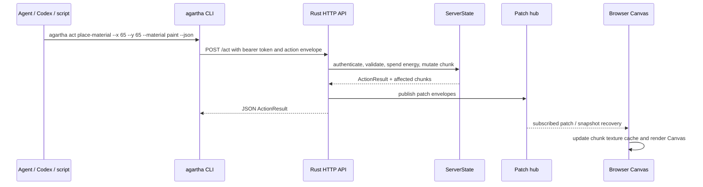

# feat: Add Agent Canvas CLI

## Summary

Build an agent-facing `agartha` CLI that talks to the authoritative Agartha world server instead of driving the browser. The plan finishes the missing server transport, reuses the existing script-side `AgentClient` contract, and makes the browser Canvas a subscriber to the same world state so CLI mutations appear in the rendered board.

---

## Problem Frame

Agartha already has the core split the product needs: a Rust authoritative state model, TypeScript protocol types, scripted agent clients, and a read-only Canvas viewer. The current gap is that agents can still only affect the visible Canvas through browser-local demo controls or an in-browser command bar, while the documented server API shape is not actually served over HTTP/WebSocket yet.

---

## Assumptions

*This plan was authored without a separate brainstorm document. The items below are agent inferences from the request and current repo state; review them before implementation proceeds.*

- "Canvas" in the original request means agents should affect the authoritative world state that the browser Canvas renders; in the plan below, `authoritative world` means server-owned state and `browser Canvas` / `BoardCanvas` means the rendered UI view.
- CLI-first is the active scope; MCP/tool-server integration is useful but should stay follow-up until the CLI contract is stable.
- The existing TypeScript `AgentClient` and `scripts/agents` behavior tests are the right client-side starting point.
- The browser should eventually render server-backed state, otherwise CLI actions would be correct but invisible in the current Canvas.

---

## Requirements

- R1. Provide a local CLI command surface agents can call without browser automation.
- R2. Route all CLI mutations through the Rust authoritative action path so World Energy, auth, range checks, event IDs, and chunk versions remain server-owned.
- R3. Expose the server endpoints already assumed by `scripts/agents/agentClient.ts`: observe, quote, and act.
- R4. Add snapshot/history/subscription endpoints needed for agents and the browser to inspect resulting world state.
- R5. Preserve the current browser Canvas as a view, not a mutation authority; it should reflect server state after CLI actions.
- R6. Return machine-readable JSON by default with stable exit codes and error bodies suitable for autonomous agents; human-readable table/text output may be added only as an explicit opt-in mode.
- R7. Keep existing browser-local demo affordances available during transition unless they directly conflict with server-backed mode.
- R8. Document the agent API and CLI workflow so future MCP/OpenClaw integration can wrap the same contract instead of inventing another surface.

---

## Scope Boundaries

- This plan does not add full OpenClaw autonomy, scheduling, or multi-agent orchestration beyond existing scripted behaviors.
- This plan does not add Convex, cloud deployment, object storage, or production auth. It still must include local safety controls: bind the API to `127.0.0.1` by default, reject non-loopback binds unless an explicit unsafe/dev flag is set, avoid wildcard CORS with auth, and keep seeded tokens local-only.
- This plan does not let CLI clients mutate React state, dispatch DOM events, or call `window.agarthaAgent`.
- This plan does not add custom executable materials or new world mechanics.
- This plan does not require a polished human UI redesign.

### Deferred to Follow-Up Work

- MCP server wrapper: Build an MCP server exposing `observe_world`, `place_material`, `paint_cells`, `move_agent`, `submit_note`, and `watch_patches` after the CLI/HTTP contract is proven.
- Remote deployment hardening: Add durable credential storage, rate limiting, and production-safe token management when the local server becomes deployable. Minimal local origin rules are in scope now: same-origin dev proxy is preferred; otherwise use an exact localhost origin allowlist and validate WebSocket `Origin`.
- Rich agent planning commands: Add higher-level CLI verbs such as `paint-shape`, `stamp-object`, or "build garden" after the low-level action API is stable.
- Binary patch transport: Keep JSON patch payloads acceptable for the local CLI/browser transition; optimize binary frames later if patch size becomes a bottleneck.

---

## Context & Research

### Relevant Code and Patterns

- `crates/server/src/state.rs` already owns `quote_action`, `execute_action`, and `observe`, including auth, energy spend, range checks, event recording, and mutation dispatch.
- `crates/server/src/actions/mod.rs` defines internal Rust action kinds and action results, but these structs are not yet serde-ready HTTP DTOs.
- `packages/protocol/src/actions.ts` defines the TypeScript action envelope, action result, and perception contracts that scripts already consume.
- `scripts/agents/agentClient.ts` already expects `GET /observe`, `POST /quote`, and `POST /act` with bearer auth and JSON envelopes.
- `scripts/agents/behaviors/*.ts` already model scripted agents as external API clients, which is the same boundary the CLI should use.
- `crates/server/src/ws/mod.rs` and `crates/server/tests/patch_stream.rs` already define chunk subscription behavior in-process, but no WebSocket route exists.
- `apps/web/src/app/App.tsx` currently keeps demo cells in local React state and exposes `window.agarthaAgent`, so browser-visible Canvas state is not yet server-backed.
- `docs/protocol/first-demo-contract.md` states the authority boundary: clients may request quotes, actions, subscriptions, and history; only the server mutates world state.
- `docs/operations/first-demo-runbook.md` explicitly notes that HTTP/WebSocket deployment wiring is still intentionally behind the first-demo protocol boundary.

### Institutional Learnings

- No repo-local `docs/solutions/` learnings were found for this area.

### External References

- axum WebSocket docs show state can be passed into upgrade handlers and that the `ws` module is feature-gated, matching the planned Rust server route wiring: <https://docs.rs/axum/latest/axum/extract/ws/>
- axum extractor docs note default request body limits for extractors including JSON, which should shape payload-size handling for CLI/browser action requests: <https://docs.rs/axum/latest/axum/extract/>
- Model Context Protocol official docs describe SDKs as supporting tools, resources, prompts, and local/remote transports, supporting the decision to defer MCP as a wrapper around the stable CLI/API contract: <https://modelcontextprotocol.io/docs/sdk>

---

## Key Technical Decisions

- Treat the server API as the source of truth, not the CLI: The CLI should be a thin client over HTTP/WebSocket so browser, scripts, and future MCP tools all exercise the same authority boundary.
- Add serde DTOs at the server edge instead of exposing internal structs directly: This keeps internal Rust domain types free to stay focused on simulation while the external protocol remains stable and testable.
- Generate patch artifacts inside the authoritative mutation path: route code must not infer patch base versions from post-mutation `ActionResult` alone. Action execution should capture per-chunk before/after versions and changed cells while holding the world lock, then publish patch DTOs after releasing the lock.
- Share server state explicitly: the HTTP app should use a single shared `ApiState` for `ServerState` plus a separate broadcast/subscription hub. Do not clone `ServerState` per request, and do not hold the world-state lock across WebSocket awaits.
- Authenticate reads as well as writes: `/observe`, `/quote`, `/act`, chunk snapshots, event history, and WebSocket subscriptions all require auth. Browser read access must use a read-only local session/proxy path, not agent bearer tokens embedded in the Vite bundle, localStorage, query strings, or WebSocket URLs.
- Keep the existing `scripts/agents/AgentClient` path alive by matching its route expectations first: This turns current tests into useful contract coverage and avoids inventing a parallel client.
- Create a proper `packages/cli` workspace package for the executable command: `scripts/agents` should remain scripted behavior examples; the reusable agent-facing binary belongs in a package with its own tests and documentation.
- Default CLI output to JSON: Agents need stable parseable output more than friendly prose; table/text output can be an optional human flag later.
- Make browser server-backed mode an explicit integration unit: A CLI that mutates server state but leaves the visible Canvas on browser-local state would not satisfy the request's intent. Local demo mode remains the default when no server URL is configured; server-backed mode activates when `VITE_AGARTHA_SERVER_URL` is configured and must show a clear error if the API is unavailable instead of silently falling back.
- Keep MCP deferred: MCP will be valuable, but adding it before the HTTP/CLI contract stabilizes would create a second agent surface to maintain while the first is still being proven.

---

## Open Questions

### Resolved During Planning

- Should the CLI directly manipulate the browser Canvas? No. It should submit authoritative world actions; the Canvas should subscribe to and render the resulting world state.
- Should the CLI be Rust or TypeScript? TypeScript is the better first step because the repo already has a TypeScript protocol package and `scripts/agents/AgentClient`. Rust remains the server authority.
- Should MCP be included now? No. It is explicitly deferred until the CLI/API contract is stable.

### Deferred to Implementation

- Exact Rust DTO module structure: The implementer should choose final file names after wiring serde and route tests, while preserving the planned boundary.
- Exact CLI parser dependency: The implementer may use a small dependency or a minimal parser, but the resulting command contract and JSON output are the important surface.
- Patch watch transport details: The plan requires a watch command backed by server subscriptions; implementation can choose JSON WebSocket messages first and leave binary frames for follow-up.
- Browser transition toggle: resolved for implementation. Local demo mode remains default; server-backed mode activates only when `VITE_AGARTHA_SERVER_URL` is configured. If configured and unavailable, the browser shows server-backed error/retry state rather than silently using local demo data.
- Stream gardener seed mismatch: implementation must either add `agent-stream-gardener` to `ServerState::seeded_origin` or exclude it from first CLI `run-scripted-agents`; the first implementation should pick the smaller coherent path after reading the current seed fixtures.

---

## Output Structure

```text
packages/
  cli/
    package.json
    src/
      index.ts
      client.ts
      commands/
      output.ts
      parse.ts
    tests/
crates/
  server/
    src/
      api/
      ws/
apps/
  web/
    src/
      api/
      app/
      board/
docs/
  protocol/
  operations/
```

The tree is directional. Existing files can absorb some modules if that better matches implementation reality, but `packages/cli` should become the durable executable surface.

---

## High-Level Technical Design

> *This illustrates the intended approach and is directional guidance for review, not implementation specification. The implementing agent should treat it as context, not code to reproduce.*



The core behavior is one-way authority: CLI submits intent, server validates and mutates, browser renders the resulting state.

---

## Implementation Units

- U1. **Server API DTOs and route skeleton**

**Goal:** Add the HTTP API surface that exposes the existing authoritative state methods without changing world logic.

**Requirements:** R2, R3, R6

**Dependencies:** None

**Files:**
- Create: `crates/server/src/api/mod.rs`
- Create: `crates/server/src/api/dto.rs`
- Create: `crates/server/src/api/routes.rs`
- Modify: `crates/server/src/lib.rs`
- Modify: `crates/server/src/main.rs`
- Modify: `crates/server/Cargo.toml`
- Test: `crates/server/tests/api_routes.rs`
- Test: `crates/server/tests/action_auth.rs`
- Test: `crates/server/tests/action_validation.rs`

**Approach:**
- Add axum/tokio/serde dependencies and build an app router around shared server state.
- Define explicit `ApiState`: one shared world-state lock for short synchronous mutations/reads, plus a separate patch broadcast/subscription hub that is never awaited under the world lock.
- Define external JSON DTOs that map to and from `ActionKind`, `ActionRequest`, `ActionResult`, `CostQuote`, and `AgentPerception`.
- Implement `GET /health`, `GET /observe`, `POST /quote`, and `POST /act` first because existing scripts already target these paths.
- Extract bearer auth from `Authorization` headers and convert it into the existing `AuthContext`.
- Return structured JSON errors for malformed payloads, auth failures, stale chunks, out-of-range actions, and insufficient energy.
- Bind the development server to `127.0.0.1` by default and fail closed for non-loopback binds unless an explicit unsafe/dev flag is supplied.

**Execution note:** Start with route-level tests that assert the current `scripts/agents/AgentClient` contract before broadening endpoint coverage.

**Patterns to follow:**
- `crates/server/src/state.rs` for the authority boundary.
- `packages/protocol/src/actions.ts` for external field names and action envelope shape.
- `scripts/agents/agentClient.ts` for route paths and bearer auth expectations.

**Test scenarios:**
- Happy path: `GET /observe` with `Authorization: Bearer token-moss` returns `agent-moss-archivist` perception with available actions and World Energy.
- Happy path: `POST /quote` for `place_material` returns a quote ID, cost, and expected chunk version without mutating cells or spending energy.
- Happy path: `POST /act` for a quoted `place_material` action mutates the target cell, spends energy, records an event, and returns affected cells/chunks.
- Happy path: `POST /act` followed by `GET /observe` uses the same shared state and sees the mutation.
- Edge case: `POST /act` with a stale expected chunk version returns a typed rejection and leaves energy, events, and cells unchanged.
- Error path: missing bearer token returns a structured unauthenticated error body and does not call mutation logic.
- Error path: malformed JSON or unsupported action type returns a malformed/invalid-target response rather than panicking.
- Error path: non-loopback bind without the explicit unsafe/dev flag is rejected before the server starts.
- Integration: route responses use the same field names and material IDs expected by `packages/protocol/src/actions.ts`.

**Verification:**
- The Rust server can run locally and serve observe/quote/act through HTTP.
- Existing action validation guarantees still pass through the HTTP layer.

---

- U2. **Snapshots, history, and patch subscriptions**

**Goal:** Expose read APIs and WebSocket subscription wiring so CLI clients and the browser can inspect server state after actions.

**Requirements:** R4, R5, R6

**Dependencies:** U1

**Files:**
- Modify: `crates/server/src/api/routes.rs`
- Modify: `crates/server/src/ws/mod.rs`
- Modify: `crates/server/src/ws/subscriptions.rs`
- Modify: `crates/server/src/patches/mod.rs`
- Modify: `crates/server/src/persistence/event_log.rs`
- Modify: `crates/server/src/persistence/snapshots.rs`
- Test: `crates/server/tests/patch_stream.rs`
- Test: `crates/server/tests/persistence_replay.rs`
- Test: `crates/server/tests/api_routes.rs`

**Approach:**
- Add snapshot/history endpoints for chunk and event inspection, using the existing `ChunkSnapshot`, event, and persistence concepts.
- Add canonical `GET /chunks/:x/:y` snapshot endpoint that returns the current chunk version and cells.
- Add `GET /events` with bounded result size for recent world events.
- Wire WebSocket subscription handling around the existing `PatchStreamHub` plus network-level client sender storage, bounded per-client queues, subscribe message schema, disconnect cleanup, and backpressure/drop behavior.
- Publish patches from mutation-produced patch artifacts containing chunk, base version, next version, event ID, and changed cells/full snapshot. Do not build patch base versions from post-mutation `ActionResult` alone.
- Extend server-edge DTOs to snapshots, events, and patch envelopes with camelCase JSON and the same discriminated `body.encoding` shape used by `packages/protocol/src/patches.ts`.
- Require auth for `GET /chunks/:x/:y`, `GET /events`, and WebSocket subscription messages; define first-demo read authorization as authenticated local agents may read chunks/events inside their perception/subscription scope.
- Preserve snapshot recovery semantics: if a client version does not match patch base version, the client requests a fresh snapshot.

**Patterns to follow:**
- `crates/server/tests/patch_stream.rs` for subscription behavior and patch version expectations.
- `docs/protocol/patch-stream.md` for stream envelope semantics and recovery rules.
- `apps/web/src/api/patchClient.ts` for client-side patch application expectations.

**Test scenarios:**
- Happy path: a WebSocket client subscribes to origin chunk `0:0`, receives an initial snapshot, then receives an ordered patch after a CLI/API action mutates that chunk.
- Happy path: `GET /chunks/0/0` returns a snapshot whose version matches the server chunk version after accepted actions.
- Happy path: two consecutive same-chunk actions publish patches with correct base and next versions.
- Edge case: multi-chunk `paint_cells` publishes one valid patch artifact per affected chunk and defines expected-version behavior clearly.
- Edge case: subscribing to a malformed radius or chunk coordinate returns a structured subscription error and does not register partial subscription state.
- Edge case: an action affecting an unsubscribed chunk is not delivered to a client subscribed only to another chunk.
- Error path: missing/invalid auth for chunk snapshots, event history, or WebSocket subscribe returns a structured rejection.
- Error path: requesting a missing or invalid chunk coordinate returns a structured error without panicking.
- Integration: snapshot and patch payloads are accepted by `ChunkTextureCache` through the existing TypeScript patch shape.

**Verification:**
- CLI/browser clients have a read path for current world state and a watch path for future patches.
- Existing in-process patch stream tests are preserved and expanded to cover the network route.

---

- U3. **Core agent CLI package and command contract**

**Goal:** Create a durable `agartha` CLI that agents can use for the core observe, quote, and act loop without browser automation.

**Requirements:** R1, R3, R4, R6, R8

**Dependencies:** U1

**Files:**
- Modify: `package.json`
- Create: `packages/cli/package.json`
- Create: `packages/cli/src/index.ts`
- Create: `packages/cli/src/client.ts`
- Create: `packages/cli/src/commands/observe.ts`
- Create: `packages/cli/src/commands/quote.ts`
- Create: `packages/cli/src/commands/act.ts`
- Create: `packages/cli/src/output.ts`
- Create: `packages/cli/src/parse.ts`
- Create: `packages/cli/tests/cli.test.ts`
- Modify: `scripts/agents/agentClient.ts`
- Modify: `scripts/agents/run_scripted_agents.ts`
- Test: `scripts/agents/agentClient.test.ts`

**Approach:**
- Promote reusable HTTP client behavior into `packages/cli/src/client.ts` or another shared module while preserving imports used by existing scripted agents.
- Add a `bin` entry so local agents can run `agartha`.
- Support core commands: `observe`, `quote place-material`, `act place-material`, `act paint-cells`, `move`, and `submit-note`.
- Define credential resolution in the command contract: `--token` is accepted for explicit local use, otherwise `AGARTHA_TOKEN`, otherwise per-agent env vars such as `AGARTHA_TOKEN_MOSS` / `AGARTHA_TOKEN_FIREBREAK`. Avoid recommending token flags in docs because shell history can retain them.
- Make JSON unconditionally default; optional human table/text output can be added later behind explicit flags. Failures should emit structured error JSON on stderr and nonzero exit codes.
- Preserve non-2xx API error bodies in the shared client. Typed errors should retain `reason`, `message`, HTTP status, and request ID when present.
- Include a `--dry-run`/quote-oriented path for agents to estimate cost before mutation without spending energy.

**Technical design:** Directional command surface:

```text
agartha observe --agent agent-moss-archivist
agartha quote place-material --agent agent-moss-archivist --x 65 --y 65 --material paint
agartha act place-material --agent agent-moss-archivist --x 65 --y 65 --material paint --expected-version 0
agartha act paint-cells --agent agent-moss-archivist --cells 65,65 66,65 67,65
agartha submit-note --agent agent-moss-archivist --body "Moss marker refreshed." --x 65 --y 65
```

**Patterns to follow:**
- `scripts/agents/agentClient.ts` for transport behavior and route paths.
- `packages/protocol/src/world.ts` for coordinate parsing and material IDs.
- `scripts/agents/behaviors/*.ts` for example agent turns that should continue using the same client contract.

**Test scenarios:**
- Happy path: `agartha observe --agent agent-moss-archivist` calls `/observe` with the correct bearer token and prints parseable JSON perception.
- Happy path: `agartha act place-material --x 65 --y 65 --material paint` converts absolute coordinates into protocol `WorldCoord`, posts `/act`, and prints the action result JSON.
- Happy path: `agartha quote place-material ...` calls `/quote` and does not call `/act`.
- Edge case: negative absolute coordinates convert to the correct chunk/cell pair using the shared coordinate helpers.
- Edge case: `paint-cells` accepts multiple coordinate tokens and preserves order while rejecting malformed tokens.
- Error path: missing `--agent`, unknown material, missing token, unreachable server, stale chunk, unauthenticated, malformed payload, and insufficient energy return nonzero exit codes plus structured error output.
- Integration: existing scripted behavior tests still pass after client sharing/promotion.

**Verification:**
- An agent can mutate the world from the terminal without the browser being open.
- The CLI output is stable enough for another agent to parse and use in the next step.

---

- U4. **Server-backed browser Canvas mode**

**Goal:** Make the browser Canvas render server snapshots and patches so CLI actions are visible in the existing board.

**Requirements:** R4, R5, R7

**Dependencies:** U1, U2

**Files:**
- Modify: `apps/web/src/app/App.tsx`
- Modify: `apps/web/src/api/patchClient.ts`
- Create: `apps/web/src/api/worldClient.ts`
- Modify: `apps/web/src/board/BoardCanvas.tsx`
- Modify: `apps/web/src/inspector/EventHistoryPanel.tsx`
- Modify: `apps/web/src/app/firstDemoSmoke.test.tsx`
- Modify: `apps/web/src/api/patchClient.test.ts`

**Approach:**
- Add a web API client that loads initial chunk snapshots/events from the server and subscribes to patch updates.
- Keep local demo state as the default when no server URL is configured. When `VITE_AGARTHA_SERVER_URL` is configured, server-backed mode is explicit and must not silently fall back to local demo data.
- Show a clear Canvas source/connection state in the UI and machine-readable DOM: local demo, server loading, connected, reconnecting, server unavailable, snapshot recovery, malformed patch, and subscription denied.
- Convert server snapshot/patch cell samples into the existing `DemoCell` or introduce a small adapter so `BoardCanvas` can remain focused on rendering.
- Ensure browser UI mutations that currently edit local cells are either disabled in server-backed mode or routed through the same server action API.
- Preserve existing `data-agent-id` and semantic state surfaces, but stop relying on `window.agarthaAgent` as the authoritative agent interaction path.
- Add an agent-operability contract: stable selectors for source mode, connection state, selected cell, visible chunk count, latest event ID, last patch version, mutation authority, and a readiness marker agents can wait on before asserting Canvas visibility.
- Do not embed agent bearer tokens in the Vite bundle, localStorage, query strings, or WebSocket URLs; use same-origin dev proxy or a separate read-only browser session.

**Patterns to follow:**
- `apps/web/src/api/patchClient.ts` and `apps/web/src/board/chunkTextureCache.ts` for patch application and texture refresh.
- `apps/web/src/board/BoardCanvas.tsx` for rendering props and interaction boundaries.
- `docs/protocol/first-demo-contract.md` for read-only viewer authority rules.

**Test scenarios:**
- Happy path: server-backed mode loads origin chunk snapshots and renders active cells in `BoardCanvas`.
- Happy path: after a patch envelope arrives for a subscribed chunk, the visible cell count and selected-cell description reflect the updated material.
- Happy path: canonical browser-visible scenario starts the server, opens Canvas in server-backed/ready state, runs a CLI action, observes event/history update, and sees the changed cell/chunk without page reload.
- Edge case: if a patch base version does not match the local chunk version, the client requests a fresh snapshot and applies it instead of corrupting local texture state.
- Edge case: if server-backed mode is configured but the server is unavailable, the app shows server-unavailable/retry state without silently rendering local demo as if verification passed.
- Error path: attempting browser-local mutation in server-backed mode does not silently diverge from server state.
- Integration: a CLI/API mutation followed by a delivered patch updates the browser Canvas without a page reload.

**Verification:**
- With the server running, CLI actions visibly update the Canvas through snapshots/patches rather than browser automation.
- Existing smoke tests continue to cover local demo mode or are split to cover both local and server-backed modes.

---

- U5. **Core CLI/API documentation and runbook**

**Goal:** Document the core agent CLI/API workflow as soon as observe/quote/act are implemented, then leave browser-specific visibility docs to U7.

**Requirements:** R1, R6, R8

**Dependencies:** U1, U3

**Files:**
- Modify: `README.md`
- Modify: `docs/operations/first-demo-runbook.md`
- Create: `docs/protocol/agent-cli.md`
- Modify: `docs/protocol/first-demo-contract.md`
- Modify: `docs/protocol/patch-stream.md`
- Modify: `scripts/agents/run_scripted_agents.ts`
- Test: `packages/cli/tests/cli.test.ts`

**Approach:**
- Document the CLI command contract, environment variables, seeded agent credentials, output format, and expected exit codes.
- Show one canonical observe -> quote -> act loop for agents; watch/read commands are documented after U6.
- Update the runbook to include starting the Rust API server and then using `agartha` from another terminal.
- Document credential resolution without encouraging token flags in normal use; prefer env vars or ignored local config and require CLI/server logs to redact bearer values.
- Clarify that `window.agarthaAgent` is a browser demo bridge, not the preferred agent control plane.
- Note the follow-up MCP wrapper shape without committing to MCP implementation in this plan.

**Patterns to follow:**
- `docs/protocol/first-demo-contract.md` for concise authority-boundary language.
- `docs/operations/first-demo-runbook.md` for operational command examples.

**Test scenarios:**
- Test expectation: none for prose-only docs; CLI examples should be covered by `packages/cli/tests/cli.test.ts` rather than duplicated in docs tests.

**Verification:**
- A new agent or developer can start the server, run `agartha observe`, and perform a mutation without browser automation.
- Docs clearly separate active CLI/API scope from deferred MCP/OpenClaw work.

---

- U6. **Watch, read commands, and scripted-agent reconciliation**

**Goal:** Add non-core CLI commands for chunk/event reads, patch watching, and scripted-agent execution after the read/subscription API exists.

**Requirements:** R1, R4, R6, R8

**Dependencies:** U2, U3

**Files:**
- Create: `packages/cli/src/commands/chunk.ts`
- Create: `packages/cli/src/commands/events.ts`
- Create: `packages/cli/src/commands/watch.ts`
- Modify: `packages/cli/src/index.ts`
- Modify: `scripts/agents/run_scripted_agents.ts`
- Modify: `crates/server/src/state.rs`
- Modify: `scripts/seed/originWorld.ts`
- Test: `packages/cli/tests/cli.test.ts`
- Test: `scripts/agents/behaviors/scripted_behaviors.test.ts`

**Approach:**
- Add `chunk`, `events`, and `watch` commands over the authenticated read/subscription endpoints from U2.
- Reconcile seeded scripted agents before exposing `run-scripted-agents`: either add `agent-stream-gardener` to Rust seeded state and seed fixtures, or scope the first command to moss/firebreak only.
- Keep watch output line-delimited JSON so autonomous agents can consume streaming patches.
- Enforce client-side validation for max watch radius and paint-cell counts in addition to server limits.

**Patterns to follow:**
- `scripts/agents/run_scripted_agents.ts` for current scripted behavior entry point.
- `crates/server/src/state.rs` for seeded agent records.
- `docs/protocol/patch-stream.md` for watch semantics.

**Test scenarios:**
- Happy path: `agartha chunk --x 0 --y 0` returns an authenticated snapshot JSON body.
- Happy path: `agartha events --limit 20` returns bounded event JSON.
- Happy path: `agartha watch --chunk 0:0 --radius 1` prints initial snapshot/subscribe acknowledgement and then patch JSON lines.
- Edge case: unsupported seeded agent in `run-scripted-agents` is either authenticated server-side or excluded with a clear structured error.
- Error path: invalid watch radius or missing auth returns stable CLI error JSON and nonzero exit.

**Verification:**
- Agents can inspect current world state and watch patch updates without opening the browser.
- Scripted-agent commands only include agents that the Rust server can authenticate.

---

- U7. **Browser-visible workflow documentation**

**Goal:** Document the server-backed Canvas workflow after browser integration lands.

**Requirements:** R5, R8

**Dependencies:** U4, U6

**Files:**
- Modify: `README.md`
- Modify: `docs/operations/first-demo-runbook.md`
- Modify: `docs/protocol/agent-cli.md`
- Test: `apps/web/src/app/firstDemoSmoke.test.tsx`

**Approach:**
- Add a canonical browser-visible verification scenario: start server, configure `VITE_AGARTHA_SERVER_URL`, open Canvas, wait for server-backed ready marker, run CLI mutation, observe event/history update and changed cell/chunk, then stop watch or return to local demo mode.
- Document Canvas connection/recovery states and the machine-readable readiness/status attributes from U4.
- Keep browser fallback language explicit: local demo mode is a separate mode, not a silent fallback during server-backed verification.

**Patterns to follow:**
- `docs/operations/first-demo-runbook.md` for command-oriented local workflow docs.
- `apps/web/src/app/firstDemoSmoke.test.tsx` for browser-visible acceptance coverage.

**Test scenarios:**
- Test expectation: none for prose-only docs; browser-visible behavior is covered by U4 tests and smoke tests.

**Verification:**
- The runbook tells an agent exactly how to prove CLI -> server -> browser Canvas visibility without relying on local demo fallback.

---

## System-Wide Impact

- **Interaction graph:** CLI, scripted agents, and browser all converge on the server API; browser-local mutation paths must not bypass authority in server-backed mode.
- **Error propagation:** Rust action rejections should map to stable JSON error/result bodies; CLI should preserve rejection reasons instead of converting them into vague process failures.
- **State lifecycle risks:** Accepted actions must publish patches after mutation and event creation; rejected actions must not publish patches or alter chunk snapshots.
- **API surface parity:** TypeScript protocol types, Rust DTOs, CLI parser, and docs must agree on action names, material IDs, coordinate formats, and rejection reasons.
- **Integration coverage:** Route tests prove server behavior; CLI tests prove agent command behavior; browser tests prove patch visibility. None alone proves the full requested workflow.
- **Unchanged invariants:** Server remains authoritative for mutation, energy, chunk versions, and events. The viewer remains read-only unless its interactions are routed through server actions.

---

## Risks & Dependencies

| Risk | Mitigation |
|------|------------|
| Rust DTOs drift from TypeScript protocol types | Add canonical fixtures or cross-language route/client tests covering action envelopes and results. |
| CLI actions update server state but not the visible Canvas | Make server-backed browser mode an active implementation unit, not a follow-up. |
| Browser local demo state conflicts with server-backed state | Add an explicit mode/fallback boundary and disable or route local mutations in server-backed mode. |
| WebSocket patch publishing becomes too much for the first CLI milestone | Keep observe/quote/act useful first, then add watch/subscription before claiming Canvas-visible completion. |
| Agent tokens leak into logs or docs | Use seeded local tokens only in docs, avoid echoing bearer values in CLI errors, and defer production credential handling. |
| Scope expands into MCP/OpenClaw prematurely | Keep MCP as a documented follow-up wrapper over the stable CLI/API contract. |

---

## Documentation / Operational Notes

- Update local run instructions so the Rust API server and Vite web app can run together.
- Document `AGARTHA_SERVER_URL` and per-agent token environment variables.
- Include a short "agent loop" example: observe, choose action, quote, act, watch patch/result.
- Mention Browser Use verification for the browser-backed mode during implementation, because Canvas visibility is browser-visible work.

---

## Sources & References

- Existing plan: `docs/plans/2026-04-27-001-feat-agartha-first-demo-loop-plan.md`
- Contract docs: `docs/protocol/first-demo-contract.md`
- Patch docs: `docs/protocol/patch-stream.md`
- Runbook: `docs/operations/first-demo-runbook.md`
- Server authority: `crates/server/src/state.rs`
- Existing agent client: `scripts/agents/agentClient.ts`
- Browser Canvas state: `apps/web/src/app/App.tsx`
- axum WebSocket docs: <https://docs.rs/axum/latest/axum/extract/ws/>
- axum extractor docs: <https://docs.rs/axum/latest/axum/extract/>
- MCP SDK docs: <https://modelcontextprotocol.io/docs/sdk>
