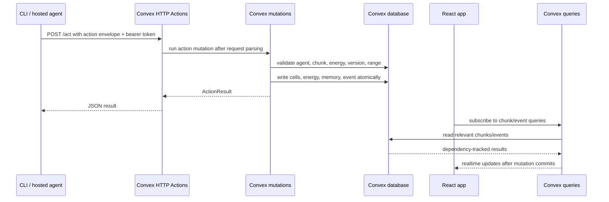
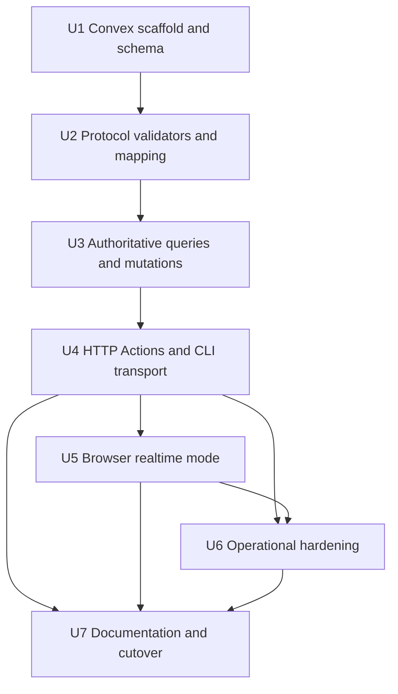

# feat: Move Agartha Authority to Convex

## Summary

Rewrite Agartha's hosted authority foundation onto Convex so browser clients, CLI agents, and future hosted agent workers share one persistent, realtime backend. The current Rust server remains a local reference during the transition, but Convex becomes the first production authority for world state, scoped agent capability tokens, energy, events, admin audit state, and browser subscriptions. Public multi-agent onboarding, endpoint discovery, and self-service token provisioning are explicit follow-up readiness work, not claims of this first rewrite.

---

## Problem Frame

Agartha now has a useful local authority model: Rust owns state, the CLI submits actions, and the browser can render server-backed state. That is enough for local experimentation, but not enough for hosted agent work where agents need a stable remote authority instead of a developer keeping `127.0.0.1:8787` alive.

The user is willing to rewrite if the long-term developer experience is better. Convex is a strong next step because it combines hosted functions, persistent data, TypeScript validation, and realtime query subscriptions without requiring a separate Rust API deployment, database setup, and custom WebSocket patch infrastructure.

---

## Requirements

### Hosted authority and compatibility

- R1. Replace the local-only Rust HTTP authority with a hosted Convex authority for first production use.
- R2. Preserve the existing agent-facing contract shape where practical: observe, quote, act, chunk read, events, watch/patch streaming or a documented replacement, admin refill, and machine-readable CLI output.

### Durable state and validation

- R3. Store durable world, chunk, agent, energy, event, symbol, note, and admin-audit state in Convex.
- R4. Keep authoritative validation server-side: auth, claimed-agent checks, energy spend, range checks, stale chunk checks, illegal overwrite checks, event creation, and chunk mutation must happen in Convex functions.

### Browser and local modes

- R5. Make the browser render Convex state through realtime queries rather than polling the Rust API.
- R6. Keep browser-local demo mode available for offline/demo use while making Convex-backed mode the hosted path.

### Security and operations

- R7. Avoid production global admin tokens as the long-term model; use scoped service tokens for CLI agents and explicit admin/audit controls for test-only bypasses.
- R8. Keep the Rust simulation/server code available as a reference and possible future worker path, but do not make it a runtime dependency for the first Convex-hosted version.
- R9. Document the new deployment and local-development workflow so agents and humans know which backend they are using.
- R10. Follow the existing-app Convex setup path: install `convex`, have the user run `npx convex dev`, rely on generated `convex/_generated` types and `.env.local`, and wire `ConvexProvider` into the current Vite/React app root.
- R11. Define and test the access-control model before exposing HTTP Actions or browser realtime queries: public demo reads, agent-token reads/writes, admin capabilities, production token storage, CORS, and redaction must be explicit.
- R12. Prove the initial sparse Convex chunk model with a sizing/load spike before treating it as the long-term storage shape for dense worlds.

---

## Scope Boundaries

- This plan does not target million-agent sharding, Durable Objects, Kafka/Redpanda, or distributed simulation workers. Those remain later-scale architecture.
- This plan does not port every Rust simulation detail if the current browser/CLI demo can be served by a sparse-cell Convex model first.
- This plan does not add user-facing account onboarding beyond the auth/service-token layer needed for agents and admin testing.
- This plan does not remove the Rust server immediately; removal or archival happens only after Convex reaches contract parity.
- This plan does not add MCP/OpenClaw wrappers. They should wrap the same CLI/HTTP contract after Convex is authoritative.
- This plan does not claim a public many-agent platform is ready. It creates the hosted authority foundation that such a platform can later wrap with discovery, onboarding, quotas, and self-service credentials.

### Deferred to Follow-Up Work

- Durable Objects or shard routing: revisit when a single Convex deployment's hot-world write pattern becomes the bottleneck.
- Rust simulation workers: add later if material physics or tick simulation outgrows TypeScript mutations.
- Binary chunk snapshot storage: move large snapshots to object storage only when sparse Convex chunk documents are no longer adequate.
- Full user auth product: integrate Clerk/WorkOS/Auth0 or Convex Auth after the agent/service-token model is proven.
- Public agent onboarding surface: add endpoint discovery, token provisioning, quota dashboards, first-action onboarding, and platform docs after the authority foundation is secure.

---

## Context & Research

### Relevant Code and Patterns

- `docs/plans/2026-05-01-001-feat-agent-canvas-cli-plan.md` established the server-authoritative model and current agent CLI contract.
- `docs/protocol/agent-canvas-cli.md` documents current routes, CLI commands, bearer-token behavior, and server-backed browser mode.
- `docs/protocol/future-convex-openclaw-boundary.md` previously deferred Convex for metadata and kept hot binary arrays outside Convex; this plan deliberately updates that direction for the next hosted product step.
- `packages/protocol/src/actions.ts`, `packages/protocol/src/world.ts`, and `packages/protocol/src/patches.ts` define the TypeScript protocol surface that should remain the compatibility anchor.
- `packages/cli/src/client.ts`, `packages/cli/src/index.ts`, and `packages/cli/tests/cli.test.ts` are the current agent CLI contract and test harness.
- `apps/web/src/api/worldClient.ts` is the current server-backed polling client; Convex integration should replace this path for hosted mode.
- `apps/web/src/app/App.tsx` owns local-demo vs server-backed behavior and must become the mode switch point for Convex-backed rendering.
- `crates/server/src/state.rs`, `crates/server/src/actions/validation.rs`, and `crates/server/src/actions/energy.rs` are the reference implementation for authoritative validation.
- `crates/server/src/api/routes.rs` and `crates/server/tests/api_routes.rs` define the current local HTTP behavior to preserve or intentionally revise.

### Institutional Learnings

- Memory from prior Agartha CLI work says the right agent surface is CLI/API interaction against an authoritative world, not browser DOM automation.
- Memory from the same work says localhost verification must confirm the page identity and backend mode before claiming browser success.
- Prior Agartha planning intentionally deferred Convex until after the first demo; that precondition is now satisfied enough to plan the hosted rewrite.

### External References

- Convex HTTP Actions expose public HTTP APIs at `.convex.site`, can route through `convex/http.ts`, and must parse/validate request bodies manually: <https://docs.convex.dev/functions/http-actions>
- Convex schemas live in `convex/schema.ts`, define table document types, and provide TypeScript type safety across functions: <https://docs.convex.dev/database/schemas>
- Convex queries are automatically realtime; client subscriptions update when query dependencies change: <https://docs.convex.dev/realtime>
- Convex auth docs emphasize that deployment endpoints are public and authorization must be checked in code or through a proper auth integration: <https://docs.convex.dev/auth>
- Convex mutations are transactional and commit all writes together, which fits `act` operations that must mutate energy, cells, events, and agent memory atomically: <https://docs.convex.dev/functions/mutation-functions>
- The local `convex-quickstart` skill says this repo should use the existing-app path: install `convex`, ask the user to run `npx convex dev` because first-run login is interactive, expect `.env.local` to receive `VITE_CONVEX_URL`, and create `ConvexReactClient` once at module scope before wrapping the React root in `ConvexProvider`.

---

## Key Technical Decisions

- Make Convex the new authoritative backend, not a sidecar metadata store: splitting authority between Rust chunks and Convex metadata would keep the hardest consistency problems and lose most of Convex's developer-experience benefit.
- Preserve the CLI contract while swapping transport internals: agents should not need to learn a new behavior model to benefit from hosted state.
- Use Convex queries/mutations for browser-owned clients and Convex HTTP Actions for generic CLI/agent callers: the browser gets realtime subscriptions; external agents get stable HTTP endpoints.
- Store the first hosted world as sparse active-cell chunk documents only after a sizing/load spike proves it fits current hosted usage. If the spike fails, keep Convex as authority for metadata/actions and move dense chunk snapshots to Rust/object-storage-backed records before browser cutover.
- Keep authoritative action validation in deterministic Convex mutations: `act` should read agent/chunk records, validate, spend energy, mutate cells, and insert an event in one transaction.
- Keep `observe` read-only by computing effective regenerated energy from stored `energy`, `energyUpdatedAt`, and current time without persisting on every observe. Mutations that spend/refill energy must persist the refreshed energy baseline before applying their write.
- Upgrade stale-version semantics for multi-chunk edits: `quote` and `act` should return/check expected versions for every affected chunk, not only the primary target chunk from the Rust reference.
- Preserve `watch` for agents through a Convex-compatible CLI subscription path that emits the current line-delimited patch/event shape. If Convex client subscriptions cannot run acceptably in the CLI environment, U4 must provide a polling fallback with the same CLI output contract before cutover.
- Treat admin energy refill as test-only operational tooling: it should require explicit enablement, produce an audit event, and not become the production capability model.
- Keep `packages/protocol` as the shared compatibility layer: Convex validators and DTO mapping should align to the existing action and world types rather than inventing parallel shapes.
- Leave Rust as a reference and future worker candidate: preserving it reduces rewrite risk without forcing a dual-runtime production path.
- Treat Convex setup as an existing-app integration, not a scaffolded replacement app: do not run `npm create convex@latest`; add Convex to this workspace and have the user run `npx convex dev` so login/deployment setup happens in their terminal.
- Use repo-root Convex configuration with explicit Vite env handling. Because the web app runs from `apps/web`, implementation must either set `apps/web/vite.config.ts` `envDir` to the repo root or sync `VITE_CONVEX_URL` into `apps/web/.env.local`; the plan chooses `envDir` unless testing shows a concrete incompatibility.
- Treat `.convex.site` endpoints as public network surfaces. Every HTTP Action must parse input, enforce bearer/service-token authorization in code, apply a CORS allowlist, and redact token/prompt/private payloads from errors and logs.

### Access-Control Matrix

| Surface | First rewrite policy | Required checks |
|---------|----------------------|-----------------|
| Browser public demo reads | Allowed only for the `origin` demo world and public world/chunk/event fields | Query allowlist, public-world flag, no agent notes/private memory/admin audit |
| Browser authenticated/private reads | Deferred until a user auth product exists | Do not expose private worlds through public queries |
| Agent observe/quote/act/watch | Scoped service token tied to agent/world/capabilities | Non-recoverable token digest, token prefix/id lookup, claimed-agent match, expiry/revocation, world scope |
| Admin refill and seed helpers | Local/dev or explicitly enabled test deployment only | Separate admin capability, env flag, audit event, seeded-token production rejection |
| Internal Convex mutations | Callable only through checked queries/HTTP handlers or tests | Capability helper reused across modules |

### Service Token Lifecycle

- Token records store an id/prefix for lookup, a non-recoverable digest, scopes, world id, optional agent id, expiry, revoked-at timestamp, and creation metadata.
- Production code must reject seeded default tokens and must not expose raw token values through Convex query results, browser bundles, HTTP errors, audit records, or CLI logs.
- Rotation creates a replacement token before revoking the old token; revocation takes effect for HTTP Actions and Convex-backed CLI watch before the next accepted action.
- Dev and production tokens are separate. Docs may show deterministic local tokens only when clearly marked as local-only.

### Data Classification and Lifecycle

| Data | Classification | First rewrite lifecycle |
|------|----------------|-------------------------|
| Public world cells and public events | Public demo data | Queryable only for public worlds; retained until world reset |
| Agent private memory, notes, rejected action details | Agent/private data | Not exposed in public browser queries; redact from logs; deletion/export deferred but table ownership must allow it |
| Service/admin tokens | Secret data | Store only non-recoverable digests; never return raw token material after creation |
| Admin audit records | Operational sensitive data | Visible only through admin-capable paths; retained for debugging until a formal retention policy exists |
| Prompts or generated art metadata | Potentially sensitive content | Store only what is needed for world state/events; redact from errors and public status text |

### Minimum Hosted World Parity

The first Convex-hosted world must preserve the product identity of Agartha as an agent-editable cellular world, not just a generic drawing API:

- Agents have durable identity, position, memory summary, energy, and scoped capabilities.
- Chunks retain cellular coordinates, materials, versions, and public event history.
- `quote` previews cost and all affected chunk versions before mutation.
- `act` accepts/rejects move, place, paint, symbol, and note actions with authoritative reasons.
- Browser rendering shows the same visible cellular world that CLI actions mutate.
- Local History reflects accepted Convex events without requiring browser-local mutation.

### Sparse Chunk Sizing Gate

Before U5 browser cutover, run a focused sizing/load spike against the sparse chunk document model:

- Define maximum active cells per chunk document for the first hosted world.
- Measure query payload size for the visible viewport, recent events, and a dense painted chunk.
- Measure write behavior for a burst of `paint_cells` actions touching one chunk and multiple chunks.
- Estimate event growth and Convex read/write cost for the first demo usage pattern.
- Pass if browser-visible query payloads, mutation latency, and document sizes remain comfortably below Convex limits for the demo world; fail into an explicit fallback design using object-storage snapshots, Rust worker snapshots, or smaller chunk documents.

### Authority Mode Flow

Browser startup must choose exactly one authority mode and surface it visibly:

1. If explicit Convex mode is configured and `VITE_CONVEX_URL` is present, use Convex-backed realtime mode.
2. If explicit Convex mode is configured but the URL/client fails, show Convex configuration error and do not fall back to browser-local terrain.
3. If explicit local Rust mode is configured, use the existing local server path and show local Rust authority status.
4. If no hosted/server authority is configured, use browser-local demo mode and label it as non-authoritative.
5. If conflicting Convex and Rust configs are present, prefer the explicit `AGARTHA_BACKEND`/mode setting; otherwise fail closed with a status message rather than silently choosing.

### Browser State Matrix

| State | Canvas behavior | Status/local history behavior |
|-------|-----------------|-------------------------------|
| Connecting to Convex | Keep canvas mounted with loading overlay or previous stable snapshot | Announce connecting state in a status region |
| Seeded public world | Render Convex cells/events | Local History shows Convex events |
| Empty world | Render empty authoritative grid, not browser demo terrain | Explain empty Convex world status |
| Realtime update success | Update cells/events without manual polling | Do not steal focus from active controls |
| Query error | Preserve last good snapshot if available and block local mutation | Show keyboard-reachable retry/error detail |
| Auth/config error | Do not render private data or fall back silently | Show explicit configuration/auth failure |
| Partial chunk/event data | Render only confirmed chunks and mark loading regions | Avoid claiming full sync |

### Convex Editing Lock and Accessibility

- In Convex-backed mode, browser pan/zoom/inspect interactions remain usable.
- Browser-local placement, painting, admin shortcuts, and mutation keyboard shortcuts are disabled unless wired to authoritative Convex mutations in a later unit.
- Blocked attempts show a concise status message and leave cells unchanged.
- Disabled controls use semantic disabled/aria-disabled states where appropriate.
- Authority status and query errors are exposed through a screen-reader-reachable status region.
- Local History updates do not steal focus; touch targets and responsive layout must remain usable in Convex mode.

---

## Open Questions

### Resolved During Planning

- Should this be Fly/Rust or Convex? Convex is chosen because the user is willing to rewrite for a better long-term developer experience, and the current need is hosted state/realtime/API productivity more than Rust runtime preservation.
- Should the browser keep polling HTTP snapshots? No for hosted mode. Convex-backed mode should use realtime queries; HTTP Actions are for CLI/external agent compatibility.
- Should Rust be deleted now? No. Keep it as reference coverage and possible future simulation-worker source until Convex reaches parity.
- Should `observe` persist regenerated energy? No. `observe` computes effective energy read-only; mutations persist refreshed energy baselines before spending/refilling.
- Should Convex preserve the Rust reference's single-primary stale check for multi-chunk paint? No. Convex should use all affected chunk versions for stronger concurrent edit safety.
- Should `watch` be dropped? No. U4 must preserve a Convex-compatible watch stream or provide a same-output polling fallback before cutover.
- Should browser reads be public? Only for explicitly public demo world data. Private agent memory, notes, rejected action details, token data, and admin audit records are not public browser query data.

### Deferred to Implementation

- Exact Convex table shapes and indexes may adjust once implementation tests expose query patterns and document sizes.
- Exact token digest implementation may use the safest supported Convex runtime primitive or a vetted dependency, but non-recoverable production token storage is required before U4 exposes HTTP Actions.
- Convex Auth is not required for the first public demo world. Scoped service tokens are the first CLI/agent auth model; full user auth remains follow-up for private browser worlds.
- Whether local browser demo remains default in dev or Convex dev becomes default should be decided after the first Convex dev loop is working.
- Exact generated file paths under `convex/_generated` are created by `npx convex dev`; implementation should not hand-write generated files.

---

## Output Structure

```text
convex/
  _generated/
    api.ts
    server.ts
  schema.ts
  http.ts
  worlds.ts
  chunks.ts
  agents.ts
  actions.ts
  events.ts
  admin.ts
  seed.ts
  lib/
    protocol.ts
    auth.ts
    coords.ts
    validation.ts
apps/
  web/
    src/
      api/
      app/
packages/
  cli/
    src/
    tests/
packages/
  protocol/
    src/
docs/
  protocol/
  operations/
  plans/
```

The structure is directional. Implementation may combine modules if that keeps the first Convex pass simpler, but the authority boundary should stay clear: Convex owns hosted state; browser and CLI are clients.

---

## High-Level Technical Design

> *This illustrates the intended approach and is directional guidance for review, not implementation specification. The implementing agent should treat it as context, not code to reproduce.*



### Implementation Dependency Graph



---

## Implementation Units

- U1. **Convex existing-app setup and persistent schema**

**Goal:** Add Convex to the existing workspace using the quickstart's existing-app path, then define the durable data model, auth/capability foundation, minimal seed path, and sparse-chunk sizing gate needed before hosted authority work proceeds.

**Requirements:** R1, R3, R7, R10, R11, R12

**Dependencies:** None

**Files:**
- Create: `convex/schema.ts`
- Create: `convex/lib/coords.ts`
- Create: `convex/lib/auth.ts`
- Create: `convex/seed.ts`
- Generated by Convex dev loop: `convex/_generated/api.ts`
- Generated by Convex dev loop: `convex/_generated/server.ts`
- Modify: `package.json`
- Modify: `package-lock.json`
- Modify: `.env.local` via user-run Convex dev setup
- Modify: `apps/web/vite.config.ts` to make repo-root `VITE_CONVEX_URL` visible to the web app, unless implementation chooses the documented `apps/web/.env.local` sync path instead
- Create: `docs/operations/convex-sizing-spike.md` or equivalent recorded spike output
- Test: `convex/schema.test.ts` or equivalent Convex test file chosen during setup
- Test: `convex/auth.test.ts`
- Test: `convex/seed.test.ts`

**Approach:**
- Add Convex as a dependency in the existing app/workspace rather than scaffolding a new project.
- Ask the user to run `npx convex dev` in their terminal for the first deployment/login/dev-loop setup; do not have the implementing agent run it because the first run may require browser-based authentication and starts a long-running watcher.
- Treat `convex/_generated` as generated checked-in support files after the dev loop creates them; do not hand-write generated type files.
- Use the Vite env variable written by Convex setup (`VITE_CONVEX_URL`) for the browser client. Because Vite runs from `apps/web`, configure `envDir` to the repo root or explicitly document/sync an `apps/web/.env.local` copy before U5.
- Define schema tables for worlds, chunks, agents, events, symbols, notes, service tokens, token rotation/revocation metadata, and admin audit entries.
- Represent chunks initially as sparse active cells keyed by world/chunk coordinate and version, not full fixed-size binary arrays.
- Include indexes needed for common access patterns: world lookup, chunk lookup, agent token lookup, events by world/time, and symbols/notes by world region.
- Store token material safely: production tokens should be hashed or otherwise non-recoverable; seeded dev tokens can be explicit only in development seeding code.
- Add shared auth helpers for service-token lookup, digest comparison, scope checks, claimed-agent checks, expiry, revocation, and redaction-safe errors.
- Add minimal idempotent seed helpers for the `origin` demo world, canonical agents, public world flag, and local-only dev tokens so U3/U4 can run without manual dashboard edits.
- Run the sparse chunk sizing/load spike before U5: record active-cell document limits, viewport query payloads, paint burst behavior, event growth, and fallback criteria.
- Reject seeded/default tokens in production-like configuration and keep admin capabilities disabled by default.

**Patterns to follow:**
- `packages/protocol/src/world.ts` for coordinate and material concepts.
- `crates/server/src/agents.rs` for seeded agent identity and energy defaults.
- `crates/server/src/events.rs` for event/symbol/note shape.
- Convex auth docs for the principle that endpoint authorization must be checked in application code.

**Test scenarios:**
- Happy path: schema accepts seeded world, three agents, empty chunk records, and initial event records.
- Happy path: service-token digest lookup authenticates a valid scoped token without returning raw token material.
- Edge case: chunk coordinates crossing the `128` boundary preserve the same absolute-to-chunk conversion used by `packages/protocol`.
- Edge case: rerunning seed does not duplicate agents, chunks, events, or token records.
- Error path: invalid material IDs and invalid cell coordinates are rejected by validators or conversion helpers before insertion.
- Error path: expired, revoked, wrong-world, wrong-agent, and production seeded tokens are rejected.
- Integration: a seeded Convex dev database can represent the current `origin` world and agents without requiring the Rust server.
- Spike: sparse chunk model remains inside the documented thresholds, or the implementation updates the plan before proceeding to browser cutover.

**Verification:**
- The user can confirm `npx convex dev` is running, `.env.local` contains `VITE_CONVEX_URL`, and `convex/_generated/api.ts` plus `convex/_generated/server.ts` exist.
- Convex dev can sync the new schema.
- Seeded data can be inspected in Convex and maps cleanly to existing TypeScript protocol types.
- Auth helpers and seed data exist before HTTP Actions or browser realtime queries depend on them.

---

- U2. **Shared protocol validators and Convex mapping**

**Goal:** Make existing TypeScript protocol types usable by Convex functions, HTTP Actions, and CLI watch output without duplicating incompatible action shapes.

**Requirements:** R2, R4, R11

**Dependencies:** U1

**Files:**
- Create: `convex/lib/protocol.ts`
- Create: `convex/lib/validation.ts`
- Modify: `packages/protocol/src/actions.ts`
- Modify: `packages/protocol/src/patches.ts`
- Modify: `packages/protocol/src/world.ts`
- Modify: `docs/protocol/agent-canvas-cli.md` if protocol behavior intentionally changes
- Test: `packages/protocol/src/actions.test.ts`
- Test: `convex/lib/protocol.test.ts`

**Approach:**
- Extend protocol validation beyond the current `place_material`-only validation so all supported action envelopes can be checked consistently.
- Add Convex-compatible validators and conversion helpers for action envelopes, world coordinates, materials, cell samples, chunk snapshots, and action results.
- Add protocol support for all affected chunk versions on quoted and submitted multi-chunk actions. Preserve old single-version inputs only as a compatibility shim if needed during transition.
- Keep the CLI `watch` output contract tied to `packages/protocol/src/patches.ts`, even if the Convex implementation uses subscriptions or polling internally.
- Preserve existing reason strings and field names so current CLI output remains stable.
- Keep Convex-specific document IDs out of the public agent protocol; external callers should continue speaking in world IDs, agent IDs, chunks, cells, and event IDs.
- Classify public vs private fields in DTO helpers so browser queries and HTTP responses do not accidentally return private memory, token, rejected-action, or admin-audit data.

**Patterns to follow:**
- `packages/protocol/src/actions.ts` for public field names.
- `crates/server/src/api/dto.rs` for the Rust server's edge DTO mapping.
- `packages/cli/tests/cli.test.ts` for expected CLI request bodies.

**Test scenarios:**
- Happy path: each supported action type validates with a representative payload and converts to Convex mutation arguments.
- Happy path: `paint_cells` quote/act payloads can carry expected versions for every affected chunk.
- Edge case: absolute coordinates around chunk boundaries convert to the same chunk/cell pair as current protocol helpers.
- Error path: unsupported action type, missing payload, invalid material, empty `paint_cells`, and malformed coordinate return stable rejection reasons.
- Error path: stale expected version for any affected chunk rejects the whole multi-chunk action.
- Error path: private fields are omitted from public browser DTOs and unauthenticated HTTP responses.
- Integration: sample envelopes used by the CLI tests pass through the shared validation layer unchanged.

**Verification:**
- Protocol package tests cover all action types the CLI exposes.
- Convex functions can import or mirror the shared validators without creating a second protocol dialect.

---

- U3. **Authoritative Convex queries and mutations**

**Goal:** Port the authoritative observe/quote/act/chunk/events behavior from Rust into deterministic Convex functions.

**Requirements:** R1, R2, R3, R4, R8, R11

**Dependencies:** U1, U2

**Files:**
- Create: `convex/agents.ts`
- Create: `convex/actions.ts`
- Create: `convex/chunks.ts`
- Create: `convex/events.ts`
- Create: `convex/worlds.ts`
- Modify: `crates/server/src/state.rs` only if adding reference notes or parity tests requires it
- Test: `convex/actions.test.ts`
- Test: `convex/chunks.test.ts`
- Test: `convex/events.test.ts`

**Approach:**
- Implement Convex queries for `observe`, `chunkSnapshot`, `recentEvents`, and world metadata.
- Implement Convex mutations for `quote`, `act`, `move`, `place_material`, `paint_cells`, `register_symbol`, and `submit_note`.
- In `act`, perform authentication, claimed-agent match, refreshed energy baseline persistence, energy spend, range checks, all-affected-chunk expected-version checks, overwrite checks, chunk mutation, event insertion, and memory summary update in one mutation.
- Keep `observe` as a read-only query by computing effective regenerated energy from persisted baseline fields. Do not persist on observe; write the refreshed baseline only in mutations such as `act` and admin refill.
- Model energy regeneration from current time consistently enough for the current demo; do not overbuild simulation ticks before hosted usage requires it.
- Insert immutable events for accepted actions and optionally rejected/admin-sensitive attempts where useful for audit.
- Return existing `ActionResult`/`AgentPerception` shapes to minimize CLI and browser changes.
- Enforce access policy in every query/mutation: public demo reads only return public world data, agent-token calls only return data scoped to that token, and admin/private tables are never returned through public query helpers.

**Execution note:** Implement behavior test-first against the current Rust route test scenarios so parity failures are visible.

**Patterns to follow:**
- `crates/server/src/state.rs` for action sequencing and event summaries.
- `crates/server/src/actions/energy.rs` for costs/regeneration.
- `crates/server/src/actions/validation.rs` for range behavior; Convex intentionally upgrades stale-version validation beyond the Rust primary-target shortcut.
- `crates/server/tests/action_validation.rs` and `crates/server/tests/world_energy.rs` for parity scenarios.

**Test scenarios:**
- Happy path: `observe` returns seeded agent position, memory, visible cells, symbols, recent events, available actions, and energy.
- Happy path: repeated `observe` calls show capped effective regenerated energy without writing to the database.
- Happy path: `quote` for `paint_cells` returns the expected cost and current chunk version without spending energy.
- Happy path: accepted `place_material` spends energy, mutates one cell, increments chunk version, inserts one event, and returns affected cells/chunks.
- Happy path: accepted `paint_cells` updates multiple cells across chunk boundaries atomically and increments every affected chunk version.
- Edge case: energy regeneration caps at the agent cap and does not exceed it after repeated observe/action calls.
- Edge case: moving an agent across chunk boundaries changes position but does not mutate cells.
- Error path: mismatched claimed agent and token returns permission denied without spending energy.
- Error path: stale expected chunk version for any affected chunk rejects without cell, energy, event, or memory mutation.
- Error path: out-of-range target rejects using the same action-range semantics as the Rust reference.
- Error path: painting over non-empty cells rejects the whole batch atomically.
- Error path: unauthenticated/public browser queries cannot read private agent memory, notes, rejected-action detail, token data, or admin audit rows.
- Integration: a sequence matching the current CLI self-portrait flow works against Convex functions without Rust.

**Verification:**
- Convex tests demonstrate parity for the current supported action contract.
- Browser and CLI consumers can read accepted action results without special Convex-only fields.

---

- U4. **HTTP Actions and CLI transport migration**

**Goal:** Expose hosted agent endpoints through Convex HTTP Actions and adapt the CLI to target Convex while preserving command behavior.

**Requirements:** R1, R2, R7, R9, R11

**Dependencies:** U2, U3

**Files:**
- Create: `convex/http.ts`
- Create: `convex/admin.ts`
- Modify: `packages/cli/src/client.ts`
- Modify: `packages/cli/src/index.ts`
- Modify: `packages/cli/src/output.ts`
- Modify: `packages/cli/src/parse.ts`
- Modify: `docs/protocol/agent-canvas-cli.md`
- Test: `packages/cli/tests/cli.test.ts`
- Test: `convex/http.test.ts` or equivalent HTTP-action test harness
- Test: `convex/admin.test.ts`

**Approach:**
- Add HTTP routes for `/health`, `/observe`, `/quote`, `/act`, `/chunks`, `/events`, and `/admin/energy/refill` on the Convex `.convex.site` endpoint.
- Preserve current chunk URL ergonomics either with Convex `pathPrefix: "/chunks/"` and explicit pathname parsing or by moving the CLI to `/chunks?x=<x>&y=<y>`. The default plan is `pathPrefix` so existing `/chunks/<x>/<y>` CLI usage can remain stable.
- Keep request/response JSON compatible with current CLI behavior.
- Preserve CLI `watch` in Convex mode by using the Convex client subscription API from the CLI process and emitting the existing line-delimited patch/event stream. If that is not reliable in the CLI runtime, implement a documented polling fallback that preserves output shape and exits cleanly on interrupt.
- Add explicit CLI configuration for `AGARTHA_BACKEND=convex` or `AGARTHA_CONVEX_HTTP_URL`, while preserving `AGARTHA_SERVER_URL` for the Rust/local server until cutover completes.
- Enforce CORS allowlist and bearer/service-token checks in HTTP Actions; do not rely on client-side hiding for security.
- Add admin energy refill as a Convex mutation/HTTP Action guarded by an admin/service capability and recorded in an admin audit table.
- Make admin tooling opt-in for production deployments through environment configuration and reject local seeded admin tokens in production-like deployments.
- Return structured API errors that map to existing CLI exit codes.
- Redact raw tokens, private memory, prompts, rejected-action internals, and admin audit details from HTTP errors and CLI logs.

**Patterns to follow:**
- `packages/cli/src/client.ts` for the current fetch wrapper.
- `packages/cli/src/output.ts` for stable error JSON and exit codes.
- `crates/server/src/api/routes.rs` for current route behavior and admin refill semantics.
- Convex HTTP Actions routing constraints: exact paths or prefixes, not Express-style `:param` routing.

**Test scenarios:**
- Happy path: CLI `observe` against a mocked Convex HTTP URL sends bearer auth and prints the same JSON shape as today.
- Happy path: CLI `act paint-cells` sends the same action envelope fields to Convex as it sends to Rust.
- Happy path: CLI `admin refill-energy` targets the Convex admin endpoint when configured for Convex.
- Happy path: CLI `watch` in Convex mode emits line-delimited updates after a Convex action commits.
- Edge case: missing Convex URL produces a CLI configuration error rather than silently using local Rust.
- Edge case: `/chunks/<x>/<y>` rejects missing, malformed, non-integer, or out-of-range coordinates with structured errors.
- Error path: Convex HTTP 401/403/409 responses preserve structured reasons and map to expected exit codes.
- Error path: admin refill without admin capability, with a seeded production token, or while admin is disabled rejects without changing energy.
- Error path: CORS-denied origins and invalid bearer tokens receive redacted errors.
- Integration: one test suite can run the same CLI behavior assertions against both local Rust mock responses and Convex-shaped responses.

**Verification:**
- Existing CLI commands still work with local Rust during transition.
- The same commands can target a Convex deployment by changing environment configuration.

---

- U5. **Browser Convex realtime mode**

**Goal:** Replace server-backed polling mode with Convex-backed realtime rendering while keeping browser-local demo mode intact.

**Requirements:** R5, R6, R9, R11

**Dependencies:** U3, U4

**Files:**
- Create: `apps/web/src/api/convexWorldClient.ts`
- Create: `apps/web/src/app/ConvexProvider.tsx`
- Modify: `apps/web/src/app/App.tsx`
- Modify: `apps/web/src/api/worldClient.ts`
- Modify: `apps/web/src/board/BoardCanvas.tsx`
- Modify: `apps/web/src/vite-env.d.ts`
- Modify: `apps/web/package.json`
- Test: `apps/web/src/api/convexWorldClient.test.ts`
- Test: `apps/web/src/app/firstDemoSmoke.test.tsx`

**Approach:**
- Add Convex React client setup for hosted/realtime mode, creating `ConvexReactClient` once at module scope and wrapping the current Vite entry/root render path in `ConvexProvider`.
- Because `apps/web/index.html` loads `apps/web/src/app/App.tsx` directly, provider wiring should happen in or adjacent to `App.tsx` unless implementation first creates a dedicated entry module.
- Query the visible chunk set and recent events via Convex queries instead of polling `/chunks` and `/events`.
- Preserve local demo mode when Convex configuration is absent.
- Follow the Authority Mode Flow: explicit Convex mode with missing/broken config shows an error and does not silently fall back to browser-local terrain; conflicting configs fail closed unless an explicit backend mode chooses one.
- In Convex-backed mode, block browser-local mutations just as server-backed mode does today, so the canvas cannot diverge from authority. Pan, zoom, and inspect interactions remain available.
- Keep board renderer inputs as `DemoCell`/chunk-version style data initially so `BoardCanvas` and texture-cache code do not require a broad rewrite.
- Show clear mode/status text that distinguishes browser-local, local Rust, and Convex-backed authority.
- Apply the Browser State Matrix for connecting, seeded, empty, realtime success, query error, auth/config error, and partial-data states.
- Expose authority status and query errors through keyboard-reachable UI and a screen-reader-reachable status region.
- Restrict browser queries to public demo world fields until a real user-auth product exists; private notes, agent memory, rejected-action detail, token state, and admin audit data stay out of browser query results.

**Patterns to follow:**
- `apps/web/src/api/worldClient.ts` for current snapshot-to-demo-cell mapping.
- `apps/web/src/app/App.tsx` for current authority mode branching and root render setup.
- `apps/web/src/board/chunkTextureCache.ts` for rendering active cells from snapshots.

**Test scenarios:**
- Happy path: app root creates one Convex client at module scope and wraps the rendered app with `ConvexProvider` when `VITE_CONVEX_URL` is configured.
- Happy path: with Convex config present, the app renders cells from mocked Convex query results and displays Convex-backed authority status.
- Happy path: new event query data updates Local History without manual polling.
- Edge case: absent Convex config keeps browser-local demo behavior unchanged.
- Edge case: explicit Convex mode with missing URL, query loading, query error, or auth/config failure shows the matrix-defined status instead of silently falling back to browser-local terrain.
- Edge case: empty Convex world renders as an empty authoritative grid, not seeded browser demo terrain.
- Error path: browser-local editing controls, mutation keyboard shortcuts, and admin shortcuts are blocked in Convex-backed mode and do not mutate local cells.
- Error path: public browser queries cannot access private memory, notes, token state, rejected-action detail, or admin audit records.
- Integration: a mocked Convex mutation/query update causes `BoardCanvas` to report the expected active-cell count.

**Verification:**
- The in-app browser can show a Convex-backed board after CLI actions land in Convex.
- Browser verification confirms the visible authority mode, not just that cells rendered.
- Local demo mode remains usable without Convex credentials.

---

- U6. **Operational hardening and development workflow**

**Goal:** Make the Convex development and deployment workflow repeatable after the core authority, CLI, admin, and browser paths exist.

**Requirements:** R7, R9, R11, R12

**Dependencies:** U4, U5

**Files:**
- Create: `docs/operations/convex-runbook.md`
- Modify: `.env.local.example` if the repo has one by implementation time
- Modify: `docs/protocol/agent-canvas-cli.md`
- Modify: `packages/cli/src/index.ts`
- Modify: `docs/protocol/future-convex-openclaw-boundary.md`
- Test: `packages/cli/tests/cli.test.ts`
- Test: `docs/operations/first-demo-acceptance.md`

**Approach:**
- Document token setup, Convex dev startup, deploy URL discovery, browser configuration, and CLI configuration.
- Document that the user, not the agent, should run `npx convex dev` in normal local development; cloud/headless agent environments may use `CONVEX_AGENT_MODE=anonymous` only when that is explicitly desired.
- Ensure seeded dev tokens are clearly marked non-production and do not hide inside browser bundles.
- Document operational invariants for production-like deployments: no seeded default tokens, admin disabled unless explicitly enabled, CORS allowlist set, public-world flag understood, and error redaction verified.
- Document the sparse chunk sizing/load spike result and the fallback threshold that would move dense snapshots out of Convex documents.
- Document `watch` behavior in Convex mode, including whether the implementation uses subscriptions or the polling fallback.
- Document the Vite env strategy chosen for `VITE_CONVEX_URL`.
- Provide a first-demo acceptance checklist that exercises seed, observe, quote, act, watch, admin refill, browser realtime rendering, and admin audit visibility.

**Patterns to follow:**
- Current admin refill behavior in `crates/server/src/api/routes.rs`.
- Token resolution behavior in `packages/cli/src/parse.ts`.
- `docs/protocol/agent-canvas-cli.md` for command examples.
- `docs/operations/first-demo-runbook.md` for operational checklist style.

**Test scenarios:**
- Happy path: a new contributor can follow the runbook to configure Convex URLs, seed, run CLI observe/act/watch, and see browser realtime updates.
- Happy path: admin refill restores an agent to cap and inserts an audit record when explicitly enabled.
- Edge case: docs distinguish `.convex.cloud`/client URL usage from `.convex.site` HTTP Action usage.
- Error path: production/admin-disabled configuration rejects refill even with a local default token.
- Error path: missing `VITE_CONVEX_URL` in explicit Convex browser mode is documented as a visible configuration failure.
- Integration: after seeding, CLI observe/act commands work against Convex without manual dashboard edits.

**Verification:**
- A clean Convex dev deployment can be created by the user-run `npx convex dev`, seeded, and used by CLI/browser in one documented flow.
- Admin bypass can be tested but is visibly separate from normal agent authority.
- The runbook captures the auth, access-control, sizing, watch, and browser-state decisions made in this plan.

---

- U7. **Cutover, documentation, and Rust reference boundary**

**Goal:** Finish the rewrite by documenting the new authority model, keeping Rust as reference-only, and making the browser/CLI default path unambiguous.

**Requirements:** R6, R8, R9

**Dependencies:** U4, U5, U6

**Files:**
- Modify: `README.md`
- Modify: `docs/protocol/agent-canvas-cli.md`
- Modify: `docs/protocol/future-convex-openclaw-boundary.md`
- Create: `docs/protocol/convex-agent-api.md`
- Modify: `docs/operations/convex-runbook.md`
- Modify: `docs/operations/first-demo-runbook.md`
- Test: `docs/operations/first-demo-acceptance.md`

**Approach:**
- Update docs to state that Convex is the hosted authority and Rust is local/reference unless explicitly started.
- Add a Convex API contract document that maps old Rust routes to Convex functions/HTTP Actions.
- Add quickstart-specific setup instructions: install dependency, run `npx convex dev`, verify `convex/_generated` and `.env.local`, then run the frontend separately.
- Update acceptance criteria to verify browser mode, CLI target URL, active-cell count, recent events, watch output, access-control failures, and admin audit state.
- Mark any Rust-only paths as compatibility/reference, not production default.
- Update the prior Convex/OpenClaw boundary doc to explain why sparse active-cell chunks are now allowed for the first hosted world, what the sizing gate proved, and which thresholds still trigger Rust/object-storage snapshots.
- Document public-agent readiness as a follow-up milestone requiring endpoint discovery, token provisioning, quotas, and onboarding instead of implying this rewrite alone is enough for public scale.
- Include explicit rollback guidance: if Convex cutover fails, local Rust server and browser-local demo can still be used for development.

**Patterns to follow:**
- Existing `docs/protocol/agent-canvas-cli.md` command-focused style.
- Existing `docs/operations/first-demo-runbook.md` operational checklist style.

**Test scenarios:**
- Test expectation: none for docs-only edits, but documentation should be reviewed against implemented command names and environment variables.

**Verification:**
- A new contributor can follow docs to seed Convex, run the browser, run CLI observe/quote/act/watch, and verify an agent action appears in the canvas.
- The docs make it clear which steps are agent-editable and which require the user to run an interactive Convex dev command.
- Docs no longer imply that the local Rust server is the only authority path.
- Docs do not claim public many-agent readiness before credential onboarding, quotas, and endpoint discovery exist.

---

## System-Wide Impact

- **Interaction graph:** CLI, browser, Convex HTTP Actions, Convex mutations, Convex queries, and the existing Rust reference server all touch the authority story during migration.
- **Error propagation:** Convex mutation errors and HTTP Action parse/auth errors must map to existing `RejectionReason` strings and CLI exit-code behavior.
- **State lifecycle risks:** `act` mutations must update chunk version, cells, energy, memory, and events atomically; partial writes would break agent trust.
- **API surface parity:** CLI commands including `watch`, browser authority mode, docs, and future MCP/OpenClaw wrappers must all point at the same Convex-backed contract or a documented intentional replacement.
- **Security boundary:** Public Convex endpoints must be treated as hostile input surfaces; every query/action/mutation boundary needs explicit authorization and redaction.
- **Integration coverage:** Unit tests alone will not prove browser/CLI parity; at least one integration path should seed Convex, submit a CLI action, and observe browser-query state.
- **Unchanged invariants:** Agents do not mutate browser DOM or local React state directly. Browser-local mode remains a demo surface, not the hosted authority.

---

## Alternative Approaches Considered

- Fly.io + Rust Axum + Postgres: best if preserving Rust is the primary goal, but it keeps more operational surface area and custom realtime/persistence work than the user wants right now.
- Convex metadata plus Rust chunks: keeps a split-brain authority boundary and makes consistency harder than either single-authority choice.
- Cloudflare Durable Objects first: stronger eventual model for millions of concurrent agents, but premature for the current stage and would require a deeper architecture rewrite than Convex.
- Browser-only hosted state: easiest to ship visually but violates the core agent requirement that agents mutate an authoritative world outside browser automation.
- Public-agent platform first: tempting strategically, but it would add onboarding, billing/quotas, and discovery before the hosted authority is proven. This plan intentionally ships the authority foundation first.

---

## Success Metrics

- A hosted Convex deployment can accept CLI `observe`, `quote`, `act`, `events`, `chunk`, `watch`, and admin refill commands without a local Rust server.
- The browser renders Convex-backed state in realtime after a CLI action.
- Existing CLI JSON output and rejection reasons remain stable or have documented intentional changes.
- Public demo browser queries cannot read private agent memory, notes, token records, rejected-action details, or admin audit data.
- Production-like deployments reject seeded/default tokens, disabled admin refill, revoked tokens, expired tokens, wrong-world tokens, and wrong-agent claims.
- Sparse chunk sizing/load spike passes documented thresholds before browser cutover, or the plan is updated to use a different chunk storage path.
- A fresh dev environment can seed the origin world and run a first agent action from docs.
- Convex setup follows the existing-app quickstart: dependency installed, user-run `npx convex dev` completed, `VITE_CONVEX_URL` written, generated Convex types present, frontend wrapped with `ConvexProvider`.
- Rust remains available for local reference tests but is no longer required for hosted agent/browser workflows.

---

## Risk Analysis & Mitigation

| Risk | Likelihood | Impact | Mitigation |
|------|------------|--------|------------|
| Convex document model does not fit dense chunk arrays | Medium | High | Run the sparse chunk sizing/load gate before browser cutover; fail into object-storage/Rust snapshot fallback instead of assuming sparse docs scale. |
| Contract drift between Rust reference and Convex rewrite | High | Medium | Keep protocol tests and parity scenarios tied to `packages/protocol` and current CLI fixtures. |
| Admin bypass becomes unsafe production capability | Medium | High | Gate by explicit admin capability/env flag, reject seeded production tokens, audit every use, and document test-only posture. |
| Public HTTP Actions or browser queries expose private state | Medium | High | Enforce the access-control matrix, redacted errors, CORS allowlist, and negative tests before U4/U5 cutover. |
| Token lifecycle remains ad hoc | Medium | High | Store non-recoverable digests, scopes, expiry, revocation, rotation metadata, and redaction-safe logs in U1 before exposing HTTP Actions. |
| CLI `watch` regresses during Convex migration | Medium | Medium | Preserve a Convex subscription-based watch path or same-output polling fallback in U4. |
| Browser silently falls back to local demo and hides backend failures | Medium | Medium | Preserve explicit authority status and error states; Browser Use verification must confirm mode. |
| Convex realtime query scope is too broad for large worlds | Medium | Medium | Query only configured/visible chunks initially; defer viewport-driven subscriptions if needed. |
| Rewriting everything at once stalls delivery | Medium | High | Land schema/protocol first, then authoritative functions, then CLI, then browser realtime. Keep Rust fallback during migration. |

---

## Phased Delivery

### Phase 1: Convex authority foundation

- U1, U2, and U3 land auth, seed, sparse-model validation, protocol mapping, and authoritative Convex functions with parity tests but no browser cutover.

### Phase 2: Agent access and browser visibility

- U4 and U5 make the hosted authority useful to CLI agents, preserve watch behavior, and make Convex state visible in the browser with explicit access and mode states.

### Phase 3: Operational hardening and cutover

- U6 and U7 make the workflow repeatable, documented, and explicit about Rust vs Convex authority, while leaving public-agent onboarding as follow-up work.

---

## Documentation / Operational Notes

- Add a runbook that distinguishes local Rust mode, browser-local mode, Convex dev mode, and Convex production mode.
- Document Convex URLs carefully: HTTP Actions use the `.convex.site` endpoint, while React/Convex client configuration uses the generated Convex deployment URL expected by the client library.
- Document that `npx convex dev` is a user-run long-running process in normal local development; do not bake it into automated agent implementation steps.
- Keep seeded tokens out of production examples except as clearly marked local/dev values.
- Document token rotation, revocation, scopes, redaction rules, CORS allowlist, and admin enablement.
- Document the chosen `watch` implementation and how agents should consume it.
- Document the sparse chunk sizing/load result and the fallback threshold for dense worlds.
- Browser verification after implementation must confirm `Rendering Convex authoritative state` or equivalent status, not just active-cell count.

---

## Sources & References

- Existing plan: `docs/plans/2026-05-01-001-feat-agent-canvas-cli-plan.md`
- Current CLI contract: `docs/protocol/agent-canvas-cli.md`
- Prior Convex boundary note: `docs/protocol/future-convex-openclaw-boundary.md`
- Related code: `packages/protocol/src/actions.ts`
- Related code: `packages/cli/src/client.ts`
- Related code: `apps/web/src/api/worldClient.ts`
- Related code: `crates/server/src/state.rs`
- External docs: <https://docs.convex.dev/functions/http-actions>
- External docs: <https://docs.convex.dev/database/schemas>
- External docs: <https://docs.convex.dev/realtime>
- External docs: <https://docs.convex.dev/auth>
- External docs: <https://docs.convex.dev/functions/mutation-functions>
- Local skill: `convex-quickstart`
