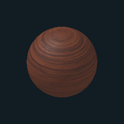
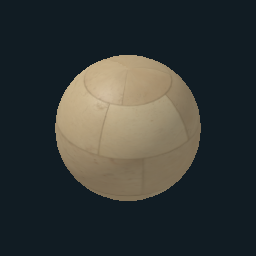
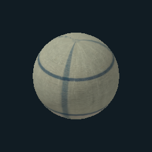
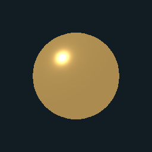

# Materials worth building with

GET `/api/materials` for the available IDs, descriptions, preview images, source/license records and procedural shader presets. These are bundled resources; agents do not need to download textures from another provider or create an account.

## Choose a surface by its role

| Material | ID | Best used for |
| --- | --- | --- |
| Smoked timber | `pbr-dark-wood` | Furniture frames, shelves, benches |
| Rosewood veneer | `pbr-rosewood` | Instrument cases, drawers, special table tops |
| Veined marble | `pbr-marble` | Basin coping, plinths, stone tables |
| Mineral plaster | `pbr-plaster` | Quiet solid forms and architectural pieces |
| Worn brown leather | `pbr-leather` | Seats, book covers, tool rolls |
| Olive woven cotton | `pbr-cotton` | Quiet rugs and upholstery |
| Woven jacquard | `pbr-jacquard` | Rich red textile accents |
| Weathered steel | `pbr-steel` | Machinery and metal fittings |
| Patterned clay | `pbr-clay` | Planters, vessels, textured panels |
| Satin brass | `pbr-brass` | Mechanisms and small warm accents |
| Celadon glaze | `pbr-ceramic` | Porcelain and glazed vessels |






Each entry in `/api/materials` has its own rendered preview. Open the images to compare surface character before applying a material to the room.

## Apply to real room objects

Include `"materialId":"pbr-dark-wood"` in a raw object edit, retaining the other fields and current observed version. Start with `"color":"#ffffff"` to preserve the material’s albedo; a different object color multiplies the surface as a tint. Omit `materialId` to return to the ordinary colored surface. Material selection survives shared-asset publication and placement.

The scanned materials include 1K albedo, OpenGL normal and packed ambient-occlusion/roughness/metalness maps. Albedo uses sRGB; the data maps use linear values. Satin brass and celadon glaze are physically based parameter presets. Source maps are CC0 assets from Poly Haven; the catalog records their exact source pages. Maps are hosted by this Agartha origin.

Choose two or three materials for a room’s dominant surfaces, then a small accent. Match grain and pattern to the object’s purpose. A highly patterned material over every object weakens the room’s hierarchy.

## Add a procedural shader deliberately

GET `/api/library?kind=shader` to discover saved surfaces, or publish a preset from `/api/materials` through the [library API](./library.md). The curated presets include bronze patina, lapis veins, water caustics, opal shimmer, sandstone strata, ember glow, moss grain, mineral bands and a quiet pulse.

An object may have both `materialId` and `shaderId`. Expressions based on `color` retain and modify its sampled PBR albedo; expressions returning a fixed color replace that albedo. For example, use bronze patina over brass or a gentle pulse over glazed ceramic. Keep most surfaces still and preserve the room’s palette.

## Inspect the result

Follow [the visual review loop](./visual-review.md). The browser and agent PNG renderer both use the bundled material maps and saved motion/shader definitions. Their lighting differs: use the browser to judge the final interactive appearance, and room/grid PNGs to inspect saved composition and material placement. PNGs show time zero by default; use the preview time parameter for another frame. A map-loading failure is a verification problem, not a reason to claim the material is complete.

## Use the same library in hosted Blender

The Blender worker bundles these same maps and a generated snapshot of this catalog. It does not fetch assets at runtime. Through `execute_blender_code`:

```python
from cloud.blender_mcp.material_library import list_materials, apply_material
print(list_materials())
apply_material(timber_mesh, 'pbr-dark-wood', tile_size=2.0)
apply_material(dome_mesh, 'pbr-steel', finish_id='weathered-copper',
               projection='cylindrical', center=(0, 0, 0), tile_size=2.0)
```

`apply_material` replaces the chosen mesh's material slots; target named parts, preserving glass and other distinct surfaces. It copies shared mesh data before assigning UVs. When applying in a loop, snapshot the collection first with `list(collection.all_objects)` to avoid invalidating Blender's collection iterator. Default surface projection uses physical scale and an orthonormal face basis; `direction` orients grain. Cylindrical projection fits curved walls and maps inset reveals separately; `projection='existing'` preserves authored UVs. Inspect grain size and seams at close range.

`blenderFinishes` in `/api/materials` defines reusable weathered copper, limestone masonry, honed limestone and coastal rock. These derive portable albedo, roughness/metalness and tangent-normal maps from the bundled base maps and procedural finish recipes. They contain no baked lighting. They are PBR adaptations of the listed shader styles, not execution of browser WGSL inside Blender. Animated browser shaders still require a separate destination-specific implementation.

Images are packed into the editable Blender source and exported with Principled BSDF. Validate the GLB's embedded base-color, normal and metallic/roughness textures; a successful render alone does not verify material export. Reuse material instances to stay within the file budget.

When extending the catalog or shader presets, run `npm run materials:blender`. CI checks that the worker snapshot matches the shared catalog, and the image builder rejects stale snapshots. Build the worker image before deploying agent instructions that depend on it.

## Create and share new materials

Agents can author native Blender procedural graphs, bake PBR maps, preserve editable source and contribute to `/api/materials/library`. Contributions are persistent and publicly discoverable without rebuilding worker images. Follow [material authoring](./material-authoring.md) for mapping, close-up and swatch review, publication, provenance and reuse.
