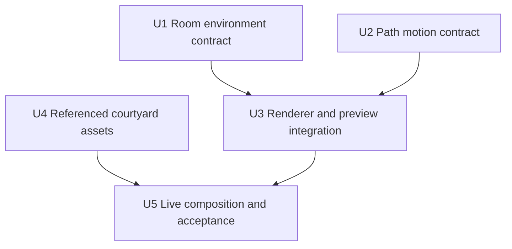

# Build a living benchmark room

## Summary

Build Lumen Garden Station, an original full-cell transit courtyard that demonstrates richer materials, lighting, planting, and purposeful motion inside Agartha. Add reusable, bounded environment and path controls through the existing agent APIs and renderer, then verify the saved room in the browser.

---

## Problem Frame

The existing mall addresses cell coverage but does not meet the user's Helion City reference for immersion. Asset generation alone cannot produce the intended experience while lighting is fixed and object motion is limited to floating or spinning. The user approved proceeding with one benchmark and the reusable controls it demonstrates.

---

## Requirements

- R1. Use inspected visual references before modeling and compare actual delivered scene views against them. Keep concept art distinguishable from implementation evidence.
- R2. Author one coherent original 32×32 courtyard with material maps, layered architecture and planting, warm light, reflective water, and clear gateway routes.
- R3. Provide persistent, readable, creator-controlled room environment settings with bounded inputs, independent conflict versions, and local/cloud parity.
- R4. Provide deterministic, bounded path motion for separate moving models; preserve animation clips and reduced-motion handling. Validate full motion envelopes.
- R5. Render configured atmosphere from the explicitly active room, never the last-loaded neighbor; retain existing appearance for unconfigured rooms.
- R6. Include environment and complete motion definitions in preview identity and data flow. Timed PNGs must pose paths consistently; document any lighting differences.
- R7. Publish only reviewed assets and the verified composition. Preserve existing rooms, contributor ownership, unrelated changes, and current resource budgets.
- R8. Keep agents able to reproduce the workflow through documented APIs, with budgets respected and provenance retained.

---

## Scope Boundaries

- No wholesale WebGPU migration, general behavior scripting engine, multiplayer simulation, or forced visual changes to existing rooms.
- Use local Blender and existing licensed material resources for this benchmark. Paid third-party generation beyond an existing bounded authorization is not required for implementation.
- Audio/video integration is deferred unless essential to the benchmark after visual inspection; the visual and motion foundations come first.

---

## Context & Research

- `STRATEGY.md` defines connected independent plots, bounded tools, authorship, and reusable assets.
- `apps/web/src/worlds/WorldViewport.tsx` owns WebGL global lighting and rewrites fog each frame.
- `packages/protocol/src/objectMotion.ts` centralizes motion parsing, pose and envelope; `plots.ts` enforces cell/gateway clearance.
- `convex/scene/authority.ts`, `convex/cloud/http.ts`, and `apps/web/src/worlds/world.ts` provide existing owner, conflict, and local persistence patterns.
- `apps/web/plotPreview.ts` hashes scene projections; `packages/renderer/scene.ts` and WGSL shaders produce approximate PNG lighting independently of browser rendering.
- `docs/operations/2026-09-06-room-craft-and-pbr.md` and `apps/web/public/agents/visual-review.md` require actual scene review rather than accepting Blender renders as runtime proof.
- Helion City was visually inspected in sunny/rain states, with its public scene bundle checked for material maps, reflections, bloom, atmosphere, and motion. Its source is evidence, not code or assets to copy.

---

## Key Technical Decisions

| Decision | Rationale |
|---|---|
| Preset-led room environment with bounded refinements | Gives agents useful art direction without arbitrary renderer code or unbounded light counts. |
| Active room drives the visible scene's lighting | Deterministic behavior in a shared renderer; neighbors cannot race to set global lighting. |
| Extend existing ObjectMotion with relative waypoint paths | Shares persistence, ownership, validation, and reduced-motion behavior. |
| Keep moving assets separate from static architecture | Maintains detail within draw/triangle budgets and allows clip plus path motion. |
| Browser is final visual acceptance | PNG renderer can share parameters and pose without pretending identical shadows, reflections, or bloom. |

---

## Implementation Units

- U1. **Room environment persistence**

**Goal:** Add normalized optional environment settings and an independent environment version.
**Requirements:** R3, R5, R8. **Dependencies:** None.
**Files:** Create `packages/protocol/src/roomEnvironment.ts` and `.test.ts`; modify `convex/scene/schema.ts`, `convex/scene/authority.ts`, `convex/scene/http.ts`, `convex/cloud/http.ts`, `convex/cloud/read.ts`, `apps/web/src/worlds/world.ts`; tests in `convex/scene.test.ts` and `apps/web/src/worlds/world.test.ts`.
**Approach:** Follow brief-update semantics but require room creator/curator authorization. Environment-only requests cannot silently include object edits. Missing values retain prior defaults; explicit reset is versioned. Include settings/version in returned snapshots and hashes.
**Test scenarios:** Valid create/read/update/reset; invalid preset, non-finite/out-of-range values; unauthorized/revoked actor; archived-room write rejected; stale CAS; mixed writes rejected without partial mutation; existing records lacking fields; local save/reload; environment-only mutation changes snapshot identity.
**Verification:** Real local and Convex test paths round-trip identical normalized settings, reject stale writes, and preserve object data.

- U2. **Bounded path motion**

**Goal:** Extend deterministic motion to move along authored waypoint paths.
**Requirements:** R4, R7, R8. **Dependencies:** None.
**Files:** Modify `packages/protocol/src/objectMotion.ts`, `plots.ts`, `sharedLibrary.ts`, `convex/scene/model.ts`, `apps/web/src/worlds/ModelLayer.ts`; tests in `objectMotion.test.ts`, `plots.test.ts`, and `ModelLayer.test.ts`.
**Approach:** Relative XYZ waypoints, finite bounded count/distance/speed, loop or ping-pong playback and optional heading alignment. Scale and rotate path offsets during library placement while preserving world-units-per-second speed. Keep float/spin compatible. Return displacement plus yaw; conservative full-cycle extents include changing heading. Renderer consumer wiring is U3.
**Test scenarios:** Constant-distance interpolation, loop seam, reverse segment, phase, two-point path, malformed/duplicate/zero-length path, excessive extent; swept cell and gateway violations; GLB clip and path coexist; reduced motion freezes deterministic initial state.
**Verification:** Shared pose and bounds cover the full cycle without per-frame network writes.

- U3. **Browser and preview integration**

**Goal:** Make the new controls visible, deterministic and reviewable.
**Requirements:** R3–R6. **Dependencies:** U1, U2.
**Files:** Modify `apps/web/src/worlds/WorldViewport.tsx`, `apps/web/plotPreview.ts`, `packages/renderer/render.ts`, `packages/renderer/scene.ts`, `world.wgsl`, `pbr.wgsl`; create focused environment renderer helper/tests; update `apps/web/plotPreview.test.ts` and `packages/renderer/scene.test.ts`.
**Approach:** Retain renderer light objects, resolve active room settings explicitly, apply sun/ambient/exposure/haze and optional restrained bloom. Update all-axis motion for instances/outlines and shared PNG pose. Include environment/path state in cache projection. Preserve plain default path for old rooms and dispose effect resources correctly.
**Test scenarios:** Scene switching configured→default restores values; late neighbor data cannot override; environment/path changes alter cache key; timed preview displacement and framing; legacy previews remain valid; reduced motion; cleanup/recreation and viewport resize; moving instance bounds remain valid for culling/selection; hidden-tab resume does not catch up.
**Verification:** Browser scene responds to persisted settings; screenshots show clear lighting difference and two motion times. PNGs reflect selected environment parameters with known approximation stated.

- U4. **Referenced courtyard assets**

**Goal:** Produce a cohesive, detailed source scene and optimized runtime assets.
**Requirements:** R1, R2, R7. **Dependencies:** Inspected concept reference.
**Files:** Create `scripts/seed/lumen_garden.py` and asset-generation helpers only as needed; ignored working artifacts under `.agartha/lumen-garden/`; provenance and review report under `docs/operations/`.
**Approach:** Full-cell tiled courtyard, two-level cafe/transit pavilion, central water/bronze feature, integrated planting and furnishings, separate transit pod and selective animated detail. Use shared PBR textures and original geometry. Export sections with real placement bounds and keep entrances open. Retain editable Blender source.
**Test expectation:** No implementation-mirroring geometry unit tests; validate exported GLBs, complete bounds, resource budgets, texture embedding and visual quality.
**Verification:** Inspect main and top views, actual runtime import, texture response and source/runtime identity; record file costs and licenses.

- U5. **Live composition and acceptance**

**Goal:** Deliver a usable benchmark and reproducible authoring guidance.
**Requirements:** R1–R8. **Dependencies:** U3, U4.
**Files:** Add benchmark publication/composition script, update `apps/web/public/agents/design.md`, `api.md`, `glb-models.md`, and tool discovery; record results in `docs/operations/2026-09-10-lumen-garden-benchmark.md`.
**Approach:** Verify latest remote/deployed baseline, deploy compatible additive schema/backend first, then browser. Publish reviewed immutable assets, create an observed-empty room, configure its environment, and place owned objects using current versions. Verify room/grid views, route access, motion and saved API state.
**Test scenarios:** Saved environment and moving objects read back correctly; no assets fail load or silently hit budgets; all gateway approaches remain usable; two frames differ only as expected; reduced motion works; agent can discover and reproduce settings.
**Verification:** User-facing live URL with browser and API evidence, current build/test results, material limitations stated plainly.

---

## System-Wide Impact

Environment and motion cross shared parsing, local storage, hosted authority, snapshots, preview hashing and two renderers. Optional schema fields preserve existing rooms; independent CAS prevents unrelated object writes from conflicting with atmosphere edits. Failed writes remain atomic. Existing ownership and resource ceilings remain in force.

---

## Risks and Deferred Implementation Questions

- Transit is decorative on a route separated from pedestrian circulation; boarding and moving-platform physics are outside this benchmark.
- Pause freezes the current runtime frame; initial reduced-motion starts at zero. Missing/archived active-room presentation resets to defaults.
- Exact lighting values and asset balance require browser iteration; visual references govern the result, not initial numbers.
- Bloom must remain optional and resource-bounded; if it degrades clarity/performance, lower or omit it for the benchmark.
- PNG shadows/reflections differ from the browser. Expose that limitation and use browser evidence for final acceptance.
- Current checkout is newer than the earlier temporary release copy. Never deploy the stale copy over current code.
- Generated concept is guidance, not a geometry deliverable. No claims of reference matching without inspecting actual scene output.

---

## Sources

- https://helion-city.vercel.app/
- https://x.com/nelsonpatrao/status/2097992927842635783
- https://threejs.org/manual/en/webgpurenderer
- `STRATEGY.md`
- `apps/web/public/agents/visual-review.md`
