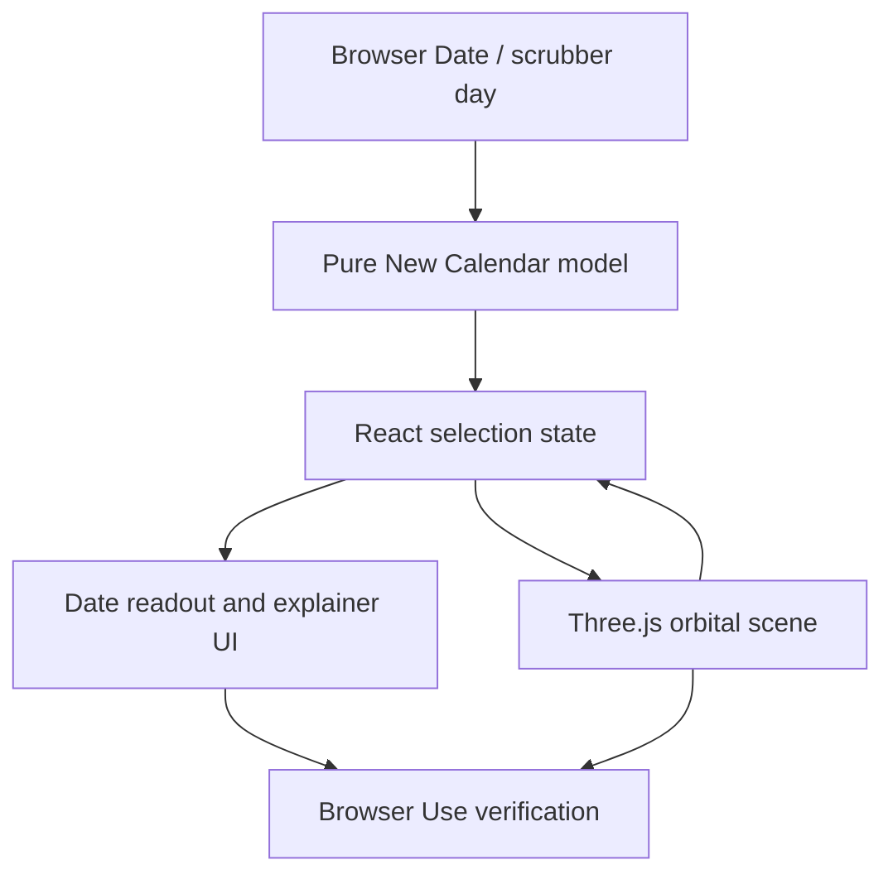
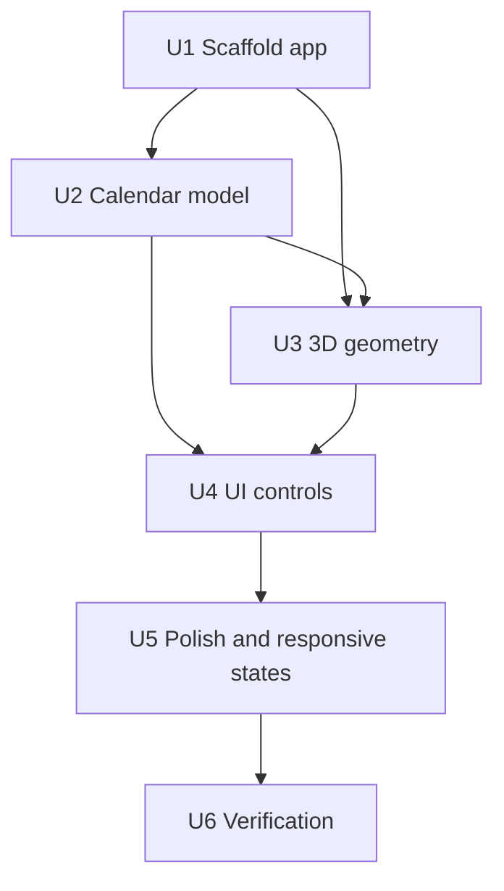

# feat: Build 3D New Calendar Timepiece

## Summary

Build a greenfield browser app that presents Tom Sherman’s New Calendar as a live 3D timepiece: a full-screen orbital year sculpture with the current day highlighted, New Calendar structure visible, and Gregorian time available as a translation layer rather than the primary frame.

---

## Problem Frame

The New Calendar’s appeal is geometric and rhythmic: equal-length seasons, reusable date positions, 9-day planetary weeks, and recurring events that do not drift year over year. A conventional flat calendar page does not make that argument quickly. The first version should make the system feel legible as an object of time, not just a set of renamed dates.

---

## Requirements

- R1. Render a first-screen interactive 3D visualization of the New Calendar as the primary experience, not a landing page or explanatory article.
- R2. Represent the core Sherman structure: 5 seasons of 73 days, 10 months, 36-day months, midpoint/reflection days, 9-day planetary week rhythm, and leap day outside the normal repeating structure.
- R3. Show the current date as a live position in the 3D year, with Gregorian date shown as supporting translation.
- R4. Allow users to orbit, zoom, hover/select calendar positions, scrub through the year, and return to today.
- R5. Include lightweight explainer overlays that reveal the calendar logic from the object itself rather than relying on long instructional copy.
- R6. Keep the app responsive and nonblank across desktop and mobile viewports, with stable control placement and no overlapping text.
- R7. Verify browser-visible behavior in the Codex in-app Browser Use surface after implementation.
- R8. Add a Krystal Spiral mechanics overlay that visualizes 45-degree octant rotation, sqrt(2) expansion, 90-degree doubling, mirrored clockwise/counter-clockwise paths, and a comparison layer without presenting the source material as empirical astronomy.

---

## Scope Boundaries

- The v1 app will not include account storage, event scheduling, reminders, or personal calendar sync.
- The v1 app will not claim official adoption status or present the New Calendar as legally recognized timekeeping.
- The v1 app will not implement a full bidirectional date conversion product beyond the current-day display, scrubber selection, and hover/selection readout.
- The v1 app will not depend on server-side rendering, backend APIs, databases, or persistent user data.
- The v1 app will not recreate the entire referenced YouTube video; the video remains inspirational source material unless implementation can extract additional specific rules.
- The v1 app will not claim the Krystal Spiral layer as scientific proof; it is an interpretive overlay from the cited spiritual/source material.

### Deferred to Follow-Up Work

- Full Gregorian/New Calendar converter: future iteration after the live timepiece is working and visually validated.
- Saved rituals, routines, or recurring events: future product layer if the timepiece proves useful.
- More authoritative source audit of leap-day placement and naming details: follow-up if Tom Sherman’s primary materials expose a canonical rule not visible in text sources.

---

## Context & Research

### Relevant Code and Patterns

- The repository is currently empty except for this plan, so there are no local components, styling conventions, tests, or build tooling to preserve.
- The plan should scaffold a compact frontend app in this repository rather than nest the work under an unnecessary monorepo structure.
- AGENTS.md requires Browser Use verification after browser-visible work; implementation should use the in-app browser as the default verification surface.

### Institutional Learnings

- No relevant `docs/solutions/` or prior plan artifacts exist in this repo.

### External References

- Technical.ly reports Sherman’s system as five seasons, 10 months, and nine-day weeks named after planets, with the core value of fixed, reusable time positions.
- Cape Gazette provides the clearest structural details: 36-day months, four 9-day weeks per month, five 73-day seasons, midpoint days between months, winter-solstice anchoring, and leap day outside normal months/seasons.
- Vite’s current guide supports a React TypeScript scaffold and modern browser target for a static frontend app.
- Three.js docs support OrbitControls for camera interaction and Raycaster for hover/select picking.
- React docs recommend isolating external imperative systems, such as a Three.js scene, behind Effects with cleanup.
- Vitest Browser Mode can verify browser-native interactions when unit tests need a real browser, while Browser Use remains the required visual verification surface for this project.

---

## Key Technical Decisions

- Use Vite + React + TypeScript as the app shell: The repo is empty, and this gives a small static app with fast iteration, typed calendar logic, and straightforward local preview.
- Use raw Three.js for the visualization scene: The core experience is a single custom 3D time object, so raw Three keeps the geometry and interaction model direct without adding a React-specific 3D abstraction layer.
- Keep date conversion and calendar structure in pure TypeScript modules: Sherman calendar math should be testable without WebGL, DOM, or animation timing.
- Make the 3D object a living instrument first and an explainer second: The primary state is today/current selection; labels and overlays explain the object without replacing it with prose.
- Treat leap day as an explicit out-of-band marker in v1: Sources agree it should not belong to a normal month or season, but exact placement should be source-checked during implementation if possible.
- Treat the Krystal Spiral as a source-framed mechanics overlay: The visualization can encode its math precisely while labeling its metaphysical framing as interpretive.
- Use Browser Use for final visual QA: This follows the repo instruction and is the verification surface that matters for layout, canvas rendering, interaction, and text overlap.

---

## Open Questions

### Resolved During Planning

- Product direction: The app should be a live 3D New Calendar timepiece with lightweight Gregorian comparison and explainer overlays.
- Implementation shape: Because the repo is empty, create a small static frontend app rather than adapt an existing framework.
- Visualization priority: Use an orbital year sculpture with selection/scrubbing rather than a flat conversion table or marketing page.

### Deferred to Implementation

- Exact visual labeling density: Tune in the browser after seeing whether labels clutter the 3D view on desktop and mobile.
- Exact leap-day visual placement: Use the best available source during implementation; if still ambiguous, mark leap day as an out-of-band summer-solstice-adjacent marker and document the assumption in UI copy.
- Final color palette: Choose during UI implementation, with a requirement to avoid a one-note palette and preserve high contrast.

---

## Output Structure

    .
    ├── index.html
    ├── package.json
    ├── tsconfig.json
    ├── vite.config.ts
    └── src
        ├── App.tsx
        ├── App.test.tsx
        ├── main.tsx
        ├── styles.css
        ├── lib
        │   ├── krystalSpiral.ts
        │   ├── krystalSpiral.test.ts
        │   ├── newCalendar.ts
        │   └── newCalendar.test.ts
        ├── visualization
        │   ├── CalendarScene.tsx
        │   ├── CalendarScene.test.tsx
        │   ├── calendarGeometry.ts
        │   └── calendarGeometry.test.ts
        └── components
            ├── DateReadout.tsx
            ├── ExplainerPanel.tsx
            └── TimeControls.tsx

---

## High-Level Technical Design

> *This illustrates the intended approach and is directional guidance for review, not implementation specification. The implementing agent should treat it as context, not code to reproduce.*

The model layer owns the date facts. React owns current selection and UI state. Three.js owns canvas rendering, camera motion, picking, and animation, and reports selected calendar positions back to React.

---

## Implementation Units

- U1. **Scaffold the Static Frontend App**

**Goal:** Establish a minimal Vite React TypeScript app with local build/test tooling and a full-viewport app shell.

**Requirements:** R1, R6

**Dependencies:** None

**Files:**
- Create: `package.json`
- Create: `index.html`
- Create: `vite.config.ts`
- Create: `tsconfig.json`
- Create: `src/main.tsx`
- Create: `src/App.tsx`
- Create: `src/styles.css`

**Approach:**
- Scaffold directly in the repo root because the repository is empty.
- Keep the first route as the usable visualization surface; no separate homepage, marketing hero, or navigation shell.
- Set up scripts for development, type checking, testing, and production build.
- Use CSS variables for palette and layout tokens so later visual tuning stays centralized.

**Patterns to follow:**
- Vite’s React TypeScript app shape.
- Existing AGENTS.md browser-verification requirement.

**Test scenarios:**
- Test expectation: none -- this unit is project scaffolding; behavior is covered by later model, scene, and UI tests.

**Verification:**
- The app can start locally, render a root component, and build as a static frontend without relying on a backend.

---

- U2. **Implement the New Calendar Model**

**Goal:** Create pure date utilities that convert a Gregorian date or day-of-year selection into New Calendar season, month, week, day, planetary day, midpoint/reflection state, leap-day state, and display metadata.

**Requirements:** R2, R3, R4

**Dependencies:** U1

**Files:**
- Create: `src/lib/newCalendar.ts`
- Create: `src/lib/newCalendar.test.ts`

**Approach:**
- Model a normal 365-position year as five 73-day seasons.
- Derive 10 months as two 36-day month blocks per season, with the remaining seasonal midpoint/reflection day represented explicitly rather than hidden.
- Represent 9-day weeks as a repeating planetary-day cycle.
- Anchor the year around the winter solstice based on the sourced Sherman description, while keeping conversion constants centralized so source corrections are localized.
- Treat leap day as a separate status outside the normal 365-position sequence.

**Execution note:** Implement this unit test-first; downstream visualization depends on these rules being stable.

**Patterns to follow:**
- Pure functions with deterministic inputs and outputs.
- Avoid browser APIs in the model module except through caller-provided dates.

**Test scenarios:**
- Happy path: Given a non-leap-year winter-solstice date, conversion returns the first winter position and first planetary day in the cycle.
- Happy path: Given March 3 in a non-leap year, conversion returns the final winter position.
- Happy path: Given March 4 in a non-leap year, conversion returns the first spring position.
- Happy path: Given May 16 in a non-leap year, conversion returns the first summer position.
- Happy path: Given July 29 in a non-leap year, conversion returns the first autumn position.
- Happy path: Given October 9 in a non-leap year, conversion returns the first fall position.
- Edge case: Given the seasonal midpoint day, conversion marks it as a reflection day and not as a normal month day.
- Edge case: Given the last normal day before winter resets, conversion returns the final fall position.
- Edge case: Given a leap day, conversion marks it as out-of-band and does not shift the reusable 365-position structure.
- Integration: A scrubber index from 0 through 364 maps to the same reusable New Calendar positions regardless of Gregorian year.

**Verification:**
- The conversion module produces stable, source-traceable calendar facts without requiring WebGL or React.

---

- U3. **Build the 3D Calendar Scene**

**Goal:** Render the calendar as an interactive Three.js timepiece with season arcs, month divisions, planetary-week rhythm, midpoint markers, leap marker, and current/selected day highlight.

**Requirements:** R1, R2, R3, R4, R6

**Dependencies:** U1, U2

**Files:**
- Create: `src/visualization/CalendarScene.tsx`
- Create: `src/visualization/CalendarScene.test.tsx`
- Create: `src/visualization/calendarGeometry.ts`
- Create: `src/visualization/calendarGeometry.test.ts`
- Modify: `src/App.tsx`
- Modify: `src/styles.css`

**Approach:**
- Use a full-bleed canvas, not a framed preview card.
- Map the 365 reusable positions onto an orbital ring or shallow spiral with five equal seasonal bands.
- Encode months and midpoint/reflection days as visible structural divisions, not hidden metadata.
- Use instanced or batched geometry where practical so 365 day markers stay performant.
- Add OrbitControls for camera orbit/zoom and Raycaster picking for hover/select.
- Keep React integration clean: mount the Three.js scene in one component, clean up renderer, listeners, controls, and animation frames on unmount.

**Patterns to follow:**
- Three.js OrbitControls for direct manipulation.
- Three.js Raycaster for picking day markers.
- React Effect cleanup for imperative external systems.

**Test scenarios:**
- Happy path: Geometry builder creates 365 selectable normal day positions for a non-leap reusable year.
- Happy path: Geometry builder creates five season arcs with equal day counts.
- Happy path: Geometry builder creates 10 month regions plus explicit midpoint/reflection markers.
- Edge case: Selected day at index 0 and selected day at index 364 both produce valid positions and labels.
- Edge case: Reduced viewport dimensions still produce bounded scene sizing inputs rather than zero-size renderer state.
- Integration: Selecting a marker in the scene updates React selection state used by the readout.
- Error path: If WebGL initialization fails, the app shows a nonblank fallback with current New Calendar readout.

**Verification:**
- The canvas renders a visible, centered, interactive calendar object on desktop and mobile viewports.
- Hover/selection maps to the same model facts produced by `src/lib/newCalendar.ts`.

---

- U4. **Add Readout, Controls, and Explainer Overlays**

**Goal:** Provide the user-facing controls and concise explanatory UI around the 3D object without turning the page into documentation.

**Requirements:** R3, R4, R5, R6

**Dependencies:** U2, U3

**Files:**
- Create: `src/components/DateReadout.tsx`
- Create: `src/components/ExplainerPanel.tsx`
- Create: `src/components/TimeControls.tsx`
- Modify: `src/App.tsx`
- Modify: `src/styles.css`
- Test: `src/App.test.tsx`

**Approach:**
- Keep controls anchored around the viewport edge with stable dimensions, so the canvas remains the main surface.
- Include a day/year scrubber, Today button, play/pause slow orbit or time animation control, and compact mode toggles for season/month/week overlays.
- Show New Calendar date first, Gregorian date second.
- Use short explainer text tied to selected structural features: season, month, midpoint/reflection day, planetary day, and leap marker.
- Avoid long instructional copy and avoid visible keyboard-shortcut/tutorial text.

**Patterns to follow:**
- Use semantic buttons, range inputs, and labelled controls.
- Keep text sizes appropriate for compact panels rather than hero typography.

**Test scenarios:**
- Happy path: Clicking Today restores the selection to the current browser date’s New Calendar position.
- Happy path: Moving the scrubber updates the selected day and readout.
- Happy path: Toggling season/month/week overlays updates visible UI state without remounting the whole app shell.
- Edge case: Long season/month labels wrap or truncate within their panels without overlapping adjacent controls.
- Edge case: Mobile viewport stacks controls without covering the primary selected-day readout.
- Integration: A scene selection and a scrubber selection both drive the same `DateReadout` content.

**Verification:**
- Users can understand the selected date and the major New Calendar structures without leaving the primary 3D experience.

---

- U5. **Apply Visual Polish, Responsiveness, and Fallback States**

**Goal:** Make the timepiece feel intentional, readable, and stable across devices, including loading and WebGL-failure states.

**Requirements:** R1, R5, R6

**Dependencies:** U3, U4

**Files:**
- Modify: `src/styles.css`
- Modify: `src/App.tsx`
- Modify: `src/visualization/CalendarScene.tsx`
- Modify: `src/components/DateReadout.tsx`
- Modify: `src/components/ExplainerPanel.tsx`
- Modify: `src/components/TimeControls.tsx`
- Test: `src/App.test.tsx`

**Approach:**
- Use a restrained multi-color system that distinguishes the five seasons without becoming a one-hue theme.
- Add depth through lighting, material contrast, focus highlights, and motion rather than decorative gradient blobs or unrelated backgrounds.
- Respect reduced-motion preferences by disabling nonessential continuous animation while preserving interaction.
- Ensure the app has explicit loading, ready, and WebGL-fallback states.
- Use responsive constraints for the canvas, panels, scrubber, and icon/control buttons so text and controls do not resize the layout unexpectedly.

**Patterns to follow:**
- Full-bleed 3D primary scene.
- Stable dimensions for fixed-format controls.
- Browser Use visual QA as the ground truth for overlap and nonblank rendering.

**Test scenarios:**
- Happy path: Initial render shows a nonblank loading or ready state before the Three.js scene finishes setup.
- Edge case: Reduced-motion preference disables autoplay rotation but leaves manual orbit controls available.
- Edge case: Narrow mobile viewport keeps the readout, controls, and canvas visible without incoherent overlap.
- Error path: Forced WebGL failure still displays the current New Calendar readout and a static structural summary.

**Verification:**
- Desktop and mobile screenshots show a polished, readable, nonblank visualization with no overlapping UI text or controls.

---

- U6. **Verify, Document, and Prepare for Handoff**

**Goal:** Validate the app with targeted automated checks and required Browser Use inspection, then leave enough documentation for future iterations.

**Requirements:** R6, R7

**Dependencies:** U1, U2, U3, U4, U5

**Files:**
- Create: `README.md`
- Modify: `package.json`
- Test: `src/lib/newCalendar.test.ts`
- Test: `src/visualization/calendarGeometry.test.ts`
- Test: `src/App.test.tsx`

**Approach:**
- Keep README focused on what the app is, how to run it, the Sherman rule assumptions, and known deferred work.
- Run focused model and geometry tests before visual verification.
- Start the local dev server for Browser Use verification after implementation.
- In Browser Use, inspect desktop and mobile-ish viewports, interact with orbit/zoom, scrubber, Today, hover/select, and overlay toggles.

**Patterns to follow:**
- Repo instruction: Browser Use is the default verification surface for browser-visible changes.
- Avoid external Playwright as the default visual verification path unless Browser Use is blocked and the user approves an alternative.

**Test scenarios:**
- Integration: Automated app test confirms selecting via UI updates the readout and preserves Gregorian translation.
- Integration: Automated app test confirms overlay toggles do not remove the primary selected-day readout.
- Integration: Browser Use visual inspection confirms canvas pixels render, controls respond, and no overlap occurs at desktop and mobile viewport sizes.

**Verification:**
- Tests pass for calendar math, geometry generation, and core React UI behavior.
- Browser Use verification records the observed rendered result and interaction checks.

---

## System-Wide Impact

- **Interaction graph:** Browser date and scrubber state feed the pure model; model output feeds React readout and Three.js scene; Three.js picking feeds selection state back into React.
- **Error propagation:** Model errors should be impossible for supported inputs; WebGL failures should degrade to a nonblank fallback rather than crash the app.
- **State lifecycle risks:** Three.js renderer, controls, event listeners, and animation frames must be cleaned up on unmount to avoid duplicate loops in React development mode.
- **API surface parity:** No external API is introduced; the internal calendar model should be reusable by future converter or scheduling features.
- **Integration coverage:** Unit tests cover model and geometry; app tests cover state handoff; Browser Use covers real rendering, layout, and interaction.
- **Unchanged invariants:** No backend, auth, persistence, or third-party calendar integration exists or should be introduced in v1.

---

## Risks & Dependencies

| Risk | Mitigation |
|------|------------|
| Calendar rule ambiguity, especially leap-day placement | Centralize constants, cite assumptions in README, and avoid overclaiming beyond sourced rules |
| Canvas renders blank on some devices | Include WebGL fallback state and verify via Browser Use canvas inspection |
| 3D labels become cluttered or unreadable | Keep labels in UI overlays/readout where possible; use geometry color/shape for structure |
| React Strict Mode duplicates Three.js side effects | Use explicit Effect cleanup for renderer, controls, listeners, and animation frame |
| Visual polish overwhelms usability | Keep the first screen an instrument: selected date, controls, and object remain primary |
| Mobile controls overlap the scene | Use stable responsive constraints and Browser Use mobile viewport checks before completion |

---

## Documentation / Operational Notes

- `README.md` should list the sourced New Calendar assumptions and distinguish confirmed rules from implementation assumptions.
- The project should remain deployable as a static Vite build.
- Browser Use verification should be reported in the implementation closeout, including the tested local URL and observed desktop/mobile behavior.

---

## Sources & References

- External source: [Technical.ly - Is our calendar outdated? Why this Delaware inventor thinks time needs a change](https://technical.ly/startups/tom-sherman-delaware-new-calendar/)
- External source: [Cape Gazette - Is the calendar dated? Thomas Sherman thinks so](https://www.capegazette.com/article/calendar-dated-thomas-sherman-thinks-so/176217)
- External source: [The New Calendar](https://thenewcalendar.com/)
- External source: [YouTube reference](https://www.youtube.com/watch?v=IhpOI9sZrRg)
- External docs: [Vite Guide](https://vite.dev/guide/)
- External docs: [Three.js OrbitControls](https://threejs.org/docs/pages/OrbitControls.html)
- External docs: [Three.js Raycaster](https://threejs.org/docs/pages/Raycaster.html)
- External docs: [React - Synchronizing with Effects](https://react.dev/learn/synchronizing-with-effects)
- External docs: [Vitest Browser Mode](https://vitest.dev/guide/browser/)
